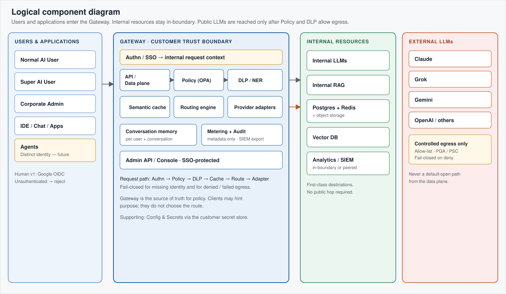
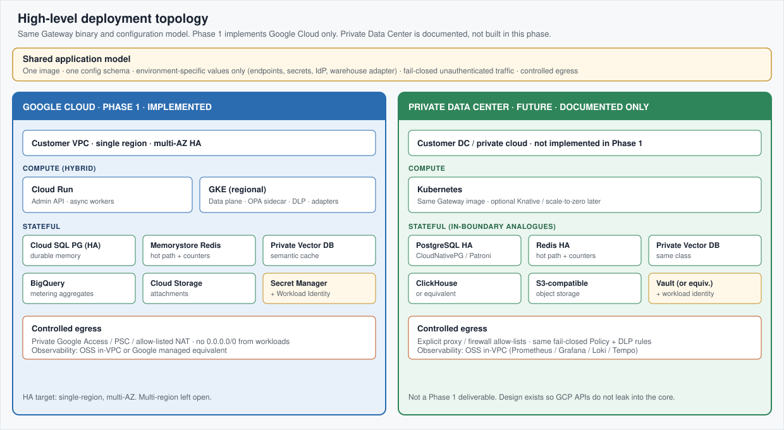
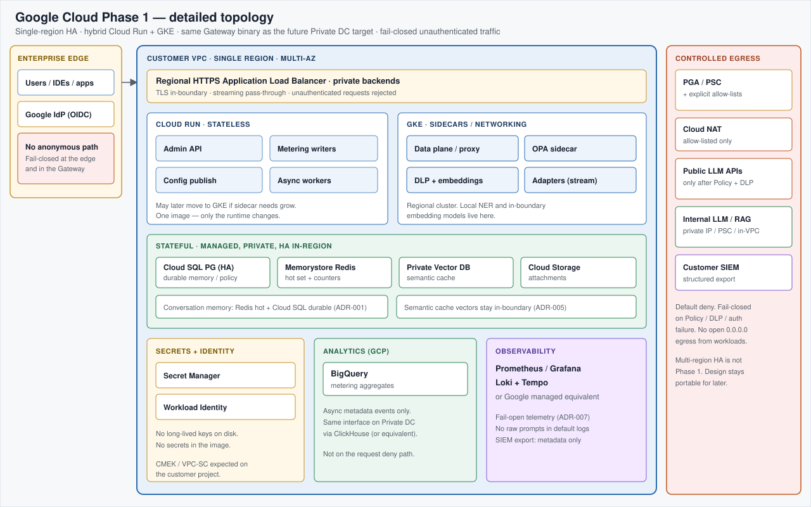

# Enterprise LLM Gateway — Architecture

> **Status:** Architecture phase  
> **Last updated:** 2026-08-14  
> **Scope:** This document is the living architecture reference for the dedicated Enterprise LLM Gateway repository. Sections will grow component by component.


---

## 1. System Context & Trust Boundaries

The Enterprise LLM Gateway is a **customer-controlled control plane** between enterprise AI clients and every model destination the organisation allows:

| Actor / System | Role |
|----------------|------|
| Normal AI User | Follows corporate policy |
| Super AI User | May override within allowlisted limits (audited) |
| Corporate Admin | Defines purpose maps, DLP rules, and routing policy |
| Enterprise IdP | **Google OIDC / OAuth 2.0** for human users in v1; other IdPs later. Identity and group → role (static map now; RBAC later). See §11. |
| Public LLM providers | Claude, Grok, Gemini, OpenAI, … (controlled egress only) |
| Internal / customer-hosted LLMs | First-class peers to public models |
| Internal RAG engine | First-class destination for internal knowledge |
| Observability / SIEM | Metrics, logs, traces, alerts |

**Trust boundary (preferred deployment):** the gateway, policy store, semantic cache, conversation memory stores, internal LLMs, and internal RAG sit **inside the corporate firewall / private VPC**. Public providers are reached only via controlled egress when policy allows. **Phase 1 implementation is Google Cloud** in a customer VPC; Private Data Center is a documented future target (see §12).

**Design principles for the boundary:**

- Gateway is the **source of truth** for policy (clients may hint purpose; they do not decide route).
- **Fail-closed** for external egress on DLP / policy failure.
- Private VPC / corporate firewall first; dedicated private cloud acceptable; pure multi-tenant public SaaS is not the primary offer.
- Thin synchronous data plane; metering, audit, and non-critical writes go async where safe.

---

## 2. Component Map

Nine core components make up the control and data planes:

| # | Component | Responsibility |
|---|-----------|----------------|
| 1 | **API Gateway / Proxy (data plane)** | Accept client requests (OpenAI-compatible and/or native), **authn** (see §11), stream proxying. Must stay thin on the hot path. |
| 2 | **Policy Engine** | Purpose → route maps, role checks, Super-user allowlists, budgets, feature flags. OPA + versioned config; fail-closed for egress. See §4. |
| 3 | **DLP / Input Guardrail Service** | Detect secrets, PII, regulated patterns, custom IP markers; redact or block before external call. Profile-driven. See §5. |
| 4 | **Semantic Cache** | Dedicated Vector DB + in-boundary embeddings; per-prompt cosine cache for DLP-clean content. See §8. |
| 5 | **Routing Engine** | Ordered models per purpose; short capped retries; circuit breakers; quotas. See §6. |
| 6 | **Conversation Memory** | Multi-turn context per user and conversation; hybrid hot/durable storage; attachment handling; summarisation. See §3. |
| 7 | **Metering & Analytics** | Aggregated usage analytics + 1–5 star feedback metadata; private-friendly analytical store. See §9. |
| 8 | **Audit Log** | Immutable-style record of decisions, overrides, blocks, admin changes. SIEM export. |
| 9 | **Admin API / Console** | CRUD for purposes, maps, roles, DLP rules, cache and memory policy. SSO-protected. |

**Supporting (not counted above):** **Provider Adapters** (common interface; normalise vendor quirks — see §7) and Config & Secrets (policy versions, provider keys, RAG endpoints via customer secret manager).



*Figure 1. Users and applications, Gateway components, internal resources, and external LLMs. Authentication is first on every request (fail-closed). Public models are reached only via controlled egress. See **§11** and **§12**.*

Further detail for each component is expanded in the dedicated subsections and ADRs below.

---

## 3. Conversation Memory (Locked Decisions)

> These decisions are **locked** for the initial architecture. Changes require a new ADR that supersedes [ADR-001](adr/001-conversation-memory-storage.md).

### 3.1 Unit of memory

- The **conversation (thread)** is the unit of memory.
- Every turn is scoped by **`user_id` + `conversation_id`**.
- No cross-user or cross-conversation context mixing — ever.

### 3.2 Hybrid storage

| Tier | Technology | Role |
|------|------------|------|
| **Hot** | Redis | Active conversation working set; low-latency read/write for multi-turn context assembly |
| **Durable** | Managed PostgreSQL | Authoritative history, metadata, retention, recovery after Redis eviction or restart |
| **Attachments** | Object storage | Files, images, and other binary payloads referenced from turns (not embedded in Redis/Postgres rows) |

### 3.3 Smart summarisation

- Older turns are **summarised** so active context stays within model window budgets without dropping the whole thread.
- Summaries remain bound to the same `user_id` + `conversation_id` isolation keys.
- Exact retention of full turns vs summary-only is policy-configurable; defaults favour privacy and cost control.

### 3.4 Strict isolation

- Isolation key: **`user_id` + `conversation_id`** on every read and write path.
- No shared caches or keys that could leak turns across users or threads.
- Agents and service accounts use the same isolation model (their own identity + conversation ids).

### 3.5 Noise reduction from day one

- Prefer structured, high-signal storage over dumping entire raw streams into memory by default.
- Tool noise, system chatter, and redundant retries should not pollute the durable thread without deliberate retention.
- Aligns with privacy-respecting metering: conversation memory is for **user experience and correct multi-turn routing**, not free-form surveillance.

### 3.6 Implications for the request path

1. Resolve identity (§11) → load or create conversation under isolation keys.
2. Assemble context from Redis (hot); fall back to Postgres + rehydrate Redis as needed.
3. Attach object-storage references for multimodal / file turns.
4. Apply policy, DLP, cache, and route as usual.
5. Persist new turns (and trigger summarisation when thresholds hit) off the critical streaming path where possible.

See **[ADR-001: Conversation Memory Storage](adr/001-conversation-memory-storage.md)** for the decision record.

---

## 4. Policy Engine

> These decisions are **locked** for the initial architecture. Changes require a new ADR that supersedes [ADR-002](adr/002-policy-engine.md).

### 4.1 Responsibility

The Policy Engine is the **authoritative decision point** for:

- Purpose → allowed destination / model bindings (and fallbacks)
- Role checks (Normal AI User vs Super AI User vs service principals / agents)
- Quotas, budgets, feature flags, and Super-user **allowlisted** overrides
- Whether **external egress** is permitted for this request

It does **not** own DLP scanning, semantic cache storage, or conversation memory — those components consume policy *outputs* (purpose, ACL scope, allow/deny, route set). The data-plane proxy stays thin: gather attributes → evaluate policy → enforce.

### 4.2 Key locked decisions

| Decision | Choice |
|----------|--------|
| Technology | **Open Policy Agent (OPA)** with Rego policies |
| Purpose UX | **Optional** — never forced on the user |
| Missing purpose | **Auto-classify** with a **small/fast LLM** against the admin catalogue |
| Purpose catalogue | Pre-populated; admins can **create / modify / delete** |
| Mandatory fallback | Built-in purpose **`General`** (always present; not deletable) |
| External egress | **Fail-closed** on deny or evaluation failure |
| Configuration | **Data-driven and versioned**; publish immutable policy snapshots; admin changes audited |
| Roles | Normal users follow policy; Super AI Users may override **within allowlists** (audited) |
| UX bar | Equal or better than native Claude / Grok / ChatGPT (type and go) |

### 4.3 High-level evaluation flow

```text
Request arrives (authn already done — §11)
        │
        ▼
┌───────────────────────┐
│ Purpose present &     │──yes──► Use client/declared purpose
│ valid for principal?  │         (still subject to OPA)
└───────────┬───────────┘
            │ no
            ▼
┌───────────────────────┐
│ Small/fast LLM        │──► Map to catalogue purpose
│ auto-classify         │    or fall back to "General"
└───────────┬───────────┘
            ▼
┌───────────────────────┐
│ OPA (Rego) evaluate   │  inputs: principal, role, purpose,
│ policy snapshot       │  requested model/route, quotas,
│                       │  override flags, egress intent
└───────────┬───────────┘
            │
     allow + route set          deny / error
            │                        │
            ▼                        ▼
   Continue to DLP /            Fail-closed for
   cache / route                external egress
            │
            ▼
   Emit decision id, policy version,
   purpose source, override flags → Audit / Metering
```

**Purpose provenance** is always recorded as one of: `client` | `classifier` | `default_general` (and later variants if needed). That keeps analytics honest when measuring “did policy or the model pick the path?”

**Latency posture:** classification and OPA evaluation sit on the path to first route selection. Prefer a small/fast classifier, short timeouts, optional short-TTL classification cache keyed by conversation/context hash, and compiled/local policy snapshots so OPA is an in-process or sidecar call — not a remote round-trip on every token.

### 4.4 Purpose for Normal users vs Super AI Users / Agents

| Principal | How purpose works | Override |
|-----------|-------------------|----------|
| **Normal AI User** | Optional client purpose; else classifier; else **`General`**. Bound only to destinations allowed for that purpose and role. | No free-form model shopping outside policy. |
| **Super AI User** | Same purpose resolution by default. May request an override (model / destination) **only if** it appears on an admin-defined allowlist for that principal or group. | Overrides are **audited** (who, what, purpose, policy version). Out-of-allowlist requests are denied. |
| **Agents / service accounts** | Same isolation and purpose model as human principals (their own identity + conversation ids). Purpose may be declared by the calling app when known (e.g. `internal_knowledge`); otherwise classifier / `General`. | Only if the service principal is granted Super-class allowlists; least privilege by default. |

**Admin-managed purposes:** the platform ships with a sensible pre-populated set (e.g. coding, realtime, image, internal knowledge, general). Admins add, rename, rebind routes, or retire purposes through the Admin API / Console. **`General` is mandatory** — it is the safety net when classification is uncertain and the default home for broad, low-specificity work. Deleting `General` is not allowed.

**UX principle:** the gateway must not feel like a bureaucracy layer. Most users never pick a purpose; they chat as they would in a native product. Policy still runs every time.

### 4.5 Policy data and versioning

- Policy **data** (purpose catalogue, route bindings, role maps, allowlists, quotas) is stored under admin control and published as **versioned snapshots**.
- The data plane evaluates against a **pinned snapshot** (not “latest mutable row mid-request”).
- Publish path: draft → validate (Rego tests / dry-run) → publish → replicas load snapshot → audit event.
- Fail-closed: if the active snapshot cannot be loaded or OPA errors on an egress decision, **do not** call public providers.

See **[ADR-002: Policy Engine (OPA)](adr/002-policy-engine.md)** for the decision record.

---

## 5. Input Guardrails / DLP

> These decisions are **locked** for the initial architecture. Changes require a new ADR that supersedes [ADR-003](adr/003-input-guardrails-dlp.md).

### 5.1 Responsibility

The Input Guardrails / DLP service inspects **user-supplied text** before a request is allowed to leave the trust boundary (and, under profile policy, before some internal routes as well). It:

- Detects secrets, PII, regulated patterns, and **custom corporate markers**
- Applies an action: **allow**, **redact**, or **hard block**
- Returns a scan result (hits, redacted text, action, rule ids) to the data plane for routing and audit
- Does **not** decide purpose or destination — that remains the Policy Engine’s job

Detection runs **entirely inside the trust boundary**. It must never call a public LLM to “check” whether content is sensitive.

### 5.2 Key locked decisions

| Decision | Choice |
|----------|--------|
| v1 detection | **Regex + pattern libraries + basic ML/NER classifiers** |
| Public LLM for DLP | **Not allowed** |
| Default action | **Redact** matched spans and **continue** |
| High-sensitivity | **Hard Block** when the active profile requires it (e.g. active patents, internal-only document markers) |
| Custom patterns | First-class; **admin-manageable** (data-driven) |
| v1 scope | **Text prompts only**; file/image scanning deferred (critical follow-on) |
| Evaluation failure | **Fail-closed** for external destinations → **Block** egress |
| Configuration | Rules, patterns, and **profiles** are data-driven; no code deploy to add a pattern |
| Policy input | Receives **`dlp_profile`** (or equivalent) from the Policy Engine |

### 5.3 High-level processing flow

```text
Policy Engine allow + route set + dlp_profile
        │
        ▼
┌───────────────────────────┐
│ Load profile snapshot     │  patterns, NER toggles,
│ (versioned, data-driven)  │  category → action map
└─────────────┬─────────────┘
              ▼
┌───────────────────────────┐
│ Scan text prompt          │  Regex / pattern packs
│ (v1: text only)           │  + basic ML/NER
└─────────────┬─────────────┘
              │
     no hits / below threshold
              │──────────────► Allow (unmodified)
              │
     hits found
              ▼
┌───────────────────────────┐
│ Resolve action per hit    │  profile category policy
│ and overall request       │  redact vs block
└─────────────┬─────────────┘
              │
     any Block category?          Redact-only hits
              │                        │
              ▼                        ▼
         Hard Block              Apply redactions
         (no external call)      (placeholders)
              │                        │
              │                        ▼
              │               Continue to cache / route
              │               with redacted text
              ▼
         User-facing denial
         (no sensitive detail leaked)
              │
              ▼
    Emit scan id, profile version, hit categories,
    action → Audit / Metering (metadata, not raw secrets)
```

**Latency posture:** keep scans synchronous but bounded (compiled regex, local NER, no remote DLP-as-a-service on the hot path unless it is in-VPC and SLO-bound). Prefer streaming-friendly design: scan the assembled user turn before first external byte is sent.

### 5.4 Relationship with the Policy Engine

| From Policy Engine | Used by DLP for |
|--------------------|-----------------|
| **`dlp_profile`** | Which pattern packs, NER features, and category→action map apply |
| Egress intent / destination type | Fail-closed path: errors on **external** routes → Block |
| Purpose / principal (optional attributes) | Audit correlation; optional profile variants by purpose |

Flow order on the request path:

1. Authn (§11) → purpose resolution → **OPA policy** (allow/deny, route set, **`dlp_profile`**)
2. **DLP scan** under that profile
3. Semantic cache / route with **redacted** (or original) text only if DLP allows continuation

DLP does not re-run OPA. If redaction changes the text, downstream components (cache keys, provider payload) use the **post-DLP** text. Cache scoping must account for profile and policy version so redacted and unredacted variants do not cross-contaminate.

### 5.5 Redact vs Block

| Mode | Behaviour | Typical use |
|------|-----------|-------------|
| **Redact (default)** | Replace spans with stable placeholders (e.g. `[REDACTED:API_KEY]`); request continues | API keys, emails, phone numbers, common secrets developers paste by mistake |
| **Hard Block** | Stop the request; no external provider call; clear user message without echoing the secret | Active patents, explicit internal-only document markers, categories the profile marks as non-negotiable |
| **Allow** | No qualifying hits | Clean text |

Principles:

- Prefer **redact-and-continue** so the product still feels like native chat for recoverable mistakes.
- **Block** remains mandatory for high-sensitivity profiles/categories — security is not only soft redaction.
- Failures (timeout, scanner crash, missing profile) on a path that would call a **public** destination → **Block** (fail-closed), consistent with ADR-002 egress posture.

### 5.6 Custom patterns

Admins manage corporate-specific detectors without code changes:

- Pattern definitions (regex / dictionary / structured detectors) and metadata (category, default action, severity)
- Packs and **profiles** that bind categories to redact vs block
- Versioned publish (draft → validate → publish), same operational spirit as policy snapshots
- Examples: product codenames, active patent identifiers, internal project keys, regulated account formats unique to the enterprise

Built-in libraries cover common secrets and PII; **custom packs are first-class**, not a bolt-on afterthought.

### 5.7 v1 scope and future file / image scanning

| Scope | v1 | Later |
|-------|----|--------|
| Chat / API **text** prompts | In scope | — |
| File uploads (PDF, Office, source archives) | Deferred | Extract text / structured scan under same profiles |
| Images / screenshots | Deferred | OCR + optional vision classifiers **in-boundary only** |
| Multimodal provider payloads | Text parts only | Full attachment pipeline |

File and image scanning is **acknowledged as critical** for real enterprise adoption (users will attach decks and screenshots). It is phased so the text action model, profiles, and admin APIs ship first without claiming multimodal coverage prematurely.

See **[ADR-003: Input Guardrails / DLP](adr/003-input-guardrails-dlp.md)** for the decision record.

---

## 6. Routing Engine

> These decisions are **locked** for the initial architecture. Changes require a new ADR that supersedes [ADR-004](adr/004-routing-and-adapters.md).

### 6.1 Responsibility

The Routing Engine turns a policy-allowed request into a concrete **destination attempt sequence**, then drives execution through Provider Adapters until success or exhaustion. It owns:

- Building the **ordered candidate list** of models for the resolved purpose
- **Short, capped retries** on the current model, then advance to the next
- **Circuit breaking** for persistently unhealthy models / providers
- **Rate limits and quotas** enforcement (per user, per agent, per purpose) before and during attempts
- Fallback to **`General`** purpose models when the purpose list is empty or fully exhausted
- Emitting routing outcome metadata for metering, audit, and the client (which model answered)

It does **not** invent policy (OPA does), scan content (DLP does), or speak vendor wire protocols (adapters do).

### 6.2 Key locked decisions

| Decision | Choice |
|----------|--------|
| Preference model | Admin-defined **ordered list of models per purpose** |
| Exhausted / no match | Fall back to models bound to **`General`** |
| Retries | Short **capped exponential** backoff on current model, then next (e.g. ~200 ms → 500 ms → 1 s; total extra delay budget ~**1.5–2 s**) |
| Health | **Circuit breaking** for persistently unhealthy models |
| Attribution | Every response must show **model + sub-model** that generated it |
| Agents | First-class **high-risk** consumers — stronger rate limits and controls |
| Abuse controls | Admin quotas/limits per **user**, **agent**, and **purpose**; throttle or hard-block abuse |
| Discovery | Periodic background sync + manual refresh for Super AI Users (feeds the catalogue routing uses) |

### 6.3 Selection, retry, and fallback flow

```text
Policy allow + purpose + principal + optional Super-user override
        │
        ▼
┌────────────────────────────┐
│ Enforce rate limits /      │──over limit──► Throttle or hard-block
│ quotas (user|agent|purpose)│                (no provider call)
└─────────────┬──────────────┘
              ▼
┌────────────────────────────┐
│ Build ordered candidates   │  purpose model list
│ (skip open circuits)       │  → else General list
└─────────────┬──────────────┘
              ▼
        For each candidate model:
              │
              ▼
┌────────────────────────────┐
│ Adapter.invoke (stream)    │
│ transient fail?            │
└─────────────┬──────────────┘
              │
     retry with short backoff     success
     (capped; ~1.5–2s budget) ──────────► Stream + attribute model
              │                              + sub-model; close circuit soft
              ▼
     retries exhausted → next candidate
              │
              ▼
     all candidates failed ──► Gateway error; open/record circuits
```

**Super AI User overrides:** if Policy allows an override, that model is tried **first** (or exclusively if policy says so), still subject to circuit state, quotas, and DLP. Out-of-allowlist overrides never reach the Routing Engine.

**Latency posture:** prefer failing over to the next healthy model over waiting many seconds on a dead one. The ~1.5–2 s extra delay budget is a **ceiling for retries on a single model**, not permission to stack long waits across the whole list without product review.

### 6.4 Circuit breaking

- Track success/failure (and optionally latency) **per model** (and optionally per provider endpoint).
- **Open** circuit after sustained failure → skip that model in candidate building.
- **Half-open** probe after cooldown; success closes circuit, failure re-opens.
- Circuit state is shared across data-plane replicas (or consistently sharded) so one replica does not keep hammering a bad model.
- Circuit open is **not** a substitute for admin removing a model from the ordered list; it is runtime protection.

### 6.5 Rate limiting, quotas, and Agents

| Principal | Controls |
|-----------|----------|
| **Normal AI User** | Per-user and per-purpose rate limits / token quotas as configured by admin |
| **Super AI User** | Same base controls; overrides do not bypass quota unless admin explicitly grants a higher envelope |
| **Agents / service accounts** | **Stricter defaults**: lower burst, lower sustained RPS, tighter token budgets; treat as high-risk automation |

Admins can:

- Set limits **per user**, **per agent**, and **per purpose**
- **Throttle** (slow / 429 with retry-after) or **hard-block** abusive behaviour
- Observe limit hits in metering without logging raw prompts by default

Agents are **first-class** Gateway consumers (F17) but must not be able to starve interactive human traffic or silently rack up cost.

### 6.6 Relationship to Policy and DLP

| Upstream | Routing uses it for |
|----------|---------------------|
| Purpose (+ provenance) | Which ordered model list to load; `General` fallback |
| Allow / deny + egress | Whether external models may appear at all |
| Super-user allowlist decision | Optional override candidate |
| Post-DLP text | Payload passed to adapters (never pre-DLP secrets that were redacted) |

Order on the path: **Policy → DLP → (optional Semantic Cache) → Routing → Adapter**.

See **[ADR-004: Routing and Adapters](adr/004-routing-and-adapters.md)** for the decision record (shared with §7).

---

## 7. Provider Adapters / LLM Integration Layer

> Locked with the Routing Engine under [ADR-004](adr/004-routing-and-adapters.md).

### 7.1 Responsibility

Provider Adapters are the **only** components that speak vendor- or system-specific APIs. Each adapter:

- Formats requests for its destination (public LLM, internal LLM, or internal RAG)
- Handles **streaming** (true proxy stream; no full-response buffering on the happy path)
- Accepts **conversation history** (and summaries) already assembled by Conversation Memory under isolation keys
- Normalises **errors**, **token usage**, and **timings** into a uniform metadata shape
- Returns enough identity for **mandatory model + sub-model attribution**

The Routing Engine and metering layer depend on adapters looking the same from the outside.

### 7.2 Common adapter interface (goals)

All adapters implement one conceptual contract (language-specific shape TBD in implementation):

| Capability | Requirement |
|------------|-------------|
| `invoke` / `stream` | Start a completion (or RAG answer) and stream tokens/events |
| History handoff | Accept ordered turns + optional summary blob from Conversation Memory |
| Cancellation | Propagate client disconnect / deadline |
| Health | Support lightweight health or rely on call outcomes for circuit inputs |
| Metadata | Always return `provider`, `model`, `sub_model` (variant), `request_id`, token counts if available, latency marks |
| Errors | Map to gateway error classes: `transient`, `rate_limited`, `auth`, `invalid_request`, `content_filtered`, `fatal` |

**Why a common interface:** consistent logging, metering, analytics, retries, and circuit decisions — without `if provider == "x"` scattered through the data plane.

### 7.3 Conversation history

- History is loaded and scoped by Conversation Memory (`user_id` + `conversation_id`) **before** the adapter call.
- Adapters receive a **normalised turn list** (and optional summary of older turns), not raw Redis keys.
- Provider-specific packing (e.g. system vs user roles, max turns, multimodal parts later) stays **inside** the adapter.
- Post-DLP redactions in the latest user turn must be what the provider sees.

### 7.4 Model discovery

| Mode | Who / when | Behaviour |
|------|------------|-----------|
| **Periodic background sync** | Platform job; **admin-configurable interval** | Refresh available models/variants from registered providers into the catalogue used by Admin Console and routing eligibility |
| **Manual refresh** | **Super AI Users** (and admins) | On-demand catalogue refresh for that provider or global scope; **audited**; rate-limited so refresh cannot become a DoS |

Discovery updates the **catalogue** of what *can* be bound into purpose ordered lists. It does not by itself change live policy bindings without admin publish — except where product allows auto-bind of new sub-variants under an existing parent (explicit policy; default is admin-controlled).

### 7.5 Mandatory model attribution

Every successful response (UI and API) must clearly indicate generation source, e.g.:

> Response generated by: **Claude 4 Sonnet** (`claude-sonnet-4-…`) via Enterprise LLM Gateway

Requirements:

- **Parent / product name** + **sub-model / variant id** as known from the adapter
- Present on streaming completion (final event and/or response headers/metadata) so clients can always display it
- Same fields land in metering for purpose × model quality analysis (including 1–5 star feedback joins)

### 7.6 Destination types under one abstraction

| `destination.type` | Adapter focus |
|--------------------|---------------|
| `public_llm` | Commercial APIs; controlled egress; streaming chat/completions |
| `internal_llm` | In-VPC / customer-hosted OpenAI-compatible or native endpoints |
| `internal_rag` | Retrieve-and-answer; pass through citations when present |

Routing treats them as ordered candidates the same way; adapters hide protocol differences.

See **[ADR-004: Routing Engine and Provider Adapters](adr/004-routing-and-adapters.md)** for the decision record.

---

## 8. Semantic Cache

> These decisions are **locked** for the initial architecture. Changes require a new ADR that supersedes [ADR-005](adr/005-semantic-cache.md).

### 8.1 Responsibility

The Semantic Cache reduces cost, latency, and provider load for **repeated or near-duplicate** prompts by storing and retrieving prior answers when policy and DLP say it is safe.

It owns:

- In-boundary **embedding** of eligible prompts
- **Similarity search** in a dedicated Vector DB
- **Scoped** store of prompt → response pairs (plus metadata for attribution and invalidation)
- **TTL, manual, and source-document** invalidation; size-based eviction

It does **not** bypass Policy or DLP, own multi-turn conversation history (Conversation Memory does), or call public models for embedding.

**Placement on the path:** Policy → DLP → **Semantic Cache (lookup)** → on miss, Routing → Adapter → **async cache write** (if eligible). Cache service failure must **not** block the gateway: bypass cache and continue to origin (fail-open for the cache hop only).

### 8.2 Key locked decisions

| Decision | Choice |
|----------|--------|
| Vector store | **Dedicated Vector Database** (mandatory) |
| Embedding model | **Local / private open model** inside the trust boundary; **bge** or **nomic** family preferred |
| Similarity metric | **Cosine similarity** |
| Threshold | Configurable; start ~**0.88–0.90**; **tunable per purpose** |
| Sharing | Only **non-sensitive / DLP-clean** content; **never** cache private or redacted data |
| Caching unit (v1) | **Per-prompt**: normalized prompt + purpose + sensitivity — **not** full multi-turn threads |
| Isolation / scoping | At least **purpose + sensitivity level** (optionally department) |
| Invalidation | Configurable **TTL** + **manual admin** + **source-document** changes (RAG-related entries) |
| Eviction | **Size-based** (max entries or max storage), **LRU** or equivalent |
| Hit-rate goal | Measurable optimization; directional target **8%+** enterprise hit rate |
| Governance | Respect **Policy + DLP** before any write and before any hit is served externally |

### 8.3 High-level flow (embed → search → hit/miss)

```text
Policy allow + purpose + cache_enabled?
        │
        ▼
DLP scan (profile-driven)
        │
        ├── Block ──────────────────────────► Stop (no cache, no route)
        │
        ├── Sensitive / redacted / not clean ► Skip cache; route to provider
        │
        └── DLP-clean + policy allows cache
                    │
                    ▼
        Normalize prompt (whitespace, trivial noise)
                    │
                    ▼
        Embed with in-boundary model (bge/nomic-class)
                    │
                    ▼
        Cosine ANN search in Vector DB
        filter: purpose + sensitivity (+ optional dept)
        score ≥ purpose threshold (~0.88–0.90 default band)
                    │
           hit                    miss
            │                      │
            ▼                      ▼
   Serve cached answer      Routing → Adapter
   + cache-hit flag         stream response
   + stored model attr             │
   (still show source)             ▼
                           Async write if still eligible:
                           embedding, response, model meta,
                           purpose, sensitivity, policy version,
                           optional source-doc refs (RAG)
```

**Latency posture:** embedding + ANN is the only cache work that blocks serving on the read path. Writes are **async** after the response is safely completed. Prefer local embedding replicas co-located with the data plane.

### 8.4 Storage and embedding model

| Layer | Choice | Notes |
|-------|--------|-------|
| Vector index | **Dedicated Vector DB** | ANN at scale; separate from Conversation Memory Redis/Postgres |
| Payload / metadata | Alongside vectors (DB fields or side store) | Response body ref, model attribution, purpose, sensitivity, TTL, source-doc ids |
| Embeddings | **Private open model** (bge / nomic preferred) | Hosted **inside** the trust boundary; no public embedding API for cache |
| Metric | **Cosine** | Consistent with normalized embedding practice |

Exact product SKUs (e.g. which managed vector service) are implementation choices; **dedicated** vector storage and **in-boundary** embeddings are not optional.

### 8.5 Isolation and sharing rules

| Rule | Detail |
|------|--------|
| Scope keys | Minimum: **`purpose` + `sensitivity_level`**; optional **`department`** (or cost centre) when policy requires |
| Shared entries | Only when content is **DLP-clean** and marked **non-sensitive** for sharing |
| Never write | Private user content, **redacted** prompts/responses, Block outcomes, purposes with `cache_enabled = false` |
| Never serve | Hits that fail a re-check against current policy version / profile if admin requires strict revalidation |
| Cross-purpose | **No** — purpose is part of the isolation key |
| Conversation Memory | Separate system; cache is **not** a substitute for per-user threads |

### 8.6 Per-prompt vs multi-turn (v1 rationale)

| Approach | v1 stance | Why |
|----------|-----------|-----|
| **Per-prompt** (normalized text + purpose + sensitivity) | **Primary** | High reuse for FAQs, agent re-asks, near-duplicates; smaller leak surface |
| **Full multi-turn thread** as cache unit | **Not v1** | Threads diverge quickly; large personal context; low hit quality vs risk |

Conversation Memory still supplies multi-turn context to the model on a **cache miss**. A cache **hit** short-circuits provider call for that prompt when similarity and policy match; it does not replace thread storage.

### 8.7 Invalidation and eviction

| Mechanism | Behaviour |
|-----------|-----------|
| **TTL** | Configurable per purpose (or global default); expired entries are not served |
| **Manual admin invalidation** | Purge by purpose, pattern, entry id, or global; audited |
| **Source-document invalidation** | For RAG-related cache entries, invalidate when registered source documents change (id / version / hash from RAG pipeline hooks) |
| **Size-based eviction** | Max entries or max storage; **LRU** (or equivalent) when over capacity |
| **Policy version** | Optional hard invalidation when policy snapshot changes for a purpose (admin-configurable strictness) |

### 8.8 Relationship with Policy Engine and DLP

| Component | Semantic Cache interaction |
|-----------|----------------------------|
| **Policy Engine** | Supplies purpose, `cache_enabled`, route eligibility, optional department scope; may disable cache for sensitive purposes entirely |
| **DLP** | Gate for **eligibility**: only **clean, non-sensitive** content is read or written; redacted text is **not** stored as a shared key/value |
| **Routing / Adapters** | Miss path only; hits skip provider call but still emit metering (cache_hit, stored model attribution) |
| **Metering** | Track hit rate, savings estimates, latency; target **8%+** as a directional enterprise KPI after baseline |

**Order:** Policy and DLP always run **before** a cache hit is returned to the client or a new entry is written. The cache is an optimization under governance, never a side door around it.

### 8.9 Operability notes

- **Bypass on failure:** if Vector DB or embedding service is down, log and continue to Routing (do not fail the user request solely for cache).
- **Tuning:** raise threshold if wrong answers appear; lower carefully if hit rate is starved and spot-checks look safe; tune **per purpose**.
- **Agents:** often benefit from modest hit rates on repeated tool/planning prompts; still subject to the same sensitivity and DLP rules.

See **[ADR-005: Semantic Cache](adr/005-semantic-cache.md)** for the decision record.

---

## 9. Metering & Feedback

> These decisions are **locked** for the initial architecture. Changes require a new ADR that supersedes [ADR-006](adr/006-metering-and-feedback.md).

### 9.1 Responsibility

Metering & Feedback provides **privacy-respecting usage visibility** and **quality signals** for operators, AI CoE, and finance — without becoming a permanent archive of employee prompts.

It owns:

- Emission and roll-up of **usage metrics** (tokens, cost estimates, purpose, route, latency, cache outcomes, principal type)
- Storage and query of **aggregated** analytics for dashboards, chargeback/showback, and CoE reports
- Optional **1–5 star** feedback joined to request **metadata**
- Hot / short-term counters that feed **live dashboards** and support **rate limiting / quotas** (with Routing)

It does **not** own Conversation Memory content, DLP pattern packs, or the immutable Audit Log of policy decisions (those remain separate systems). Metering writes are **async** and off the streaming hot path.

### 9.2 Key locked decisions

| Decision | Choice |
|----------|--------|
| Long-term store | Analytical DB/warehouse preferably **inside** (or tightly peered with) the customer VPC. **BigQuery** on GCP Phase 1; **ClickHouse** (or equivalent) on Private DC (see §12) |
| External SaaS warehouse | Only **clean aggregates**, and only with **explicit customer opt-in** |
| Long-term grain | Prefer **aggregates**; avoid permanent full per-request retention |
| Hot path | Finer-grained short-term counters for dashboards and rate limiting |
| Feedback | 1–5 stars + **rich metadata**; **no** raw prompts/responses by default |
| Privacy default | Do **not** store raw prompts or full conversation content in the metering store |
| Low scores | Especially **1-star** → **strong negative signals** for routing / quality analysis |
| Economics | Explicit support for **chargeback** and **showback** |
| v1 reports | See §9.6 |

### 9.3 Storage direction

| Tier | Role | Placement posture |
|------|------|-------------------|
| **Hot counters** | Near-real-time rates, quota enforcement inputs, ops “now” views | In-VPC with the control/data plane (e.g. Redis or equivalent) |
| **Analytical store** | Long-term aggregates, historical dashboards, chargeback exports | **BigQuery** on GCP Phase 1; **ClickHouse** (or equivalent) on Private DC. Same metering interface (see §12 / ADR-009) |
| **Opt-in external warehouse** | Customer BI stack receiving **pre-aggregated, clean** tables only | Never the default path for raw or near-raw traffic |

Private-first does not mean “no BI tools.” It means **raw and sensitive traffic stays governed**, and long-term analytics prefer customer-controlled analytical capacity over shipping every event to a multi-tenant SaaS by default. On **GCP Phase 1**, that store is **BigQuery**; the ClickHouse-class option remains the **Private DC** mapping (ADR-009). The async metadata event shape does not change.

### 9.4 Aggregation strategy

```text
Request completes (or cache hit / block outcome)
        │
        ▼
Async meter event (metadata only)
  tokens_in/out, cost_est, purpose, model, sub_model,
  latency, cache_hit, principal_type (human|agent),
  department/cost_centre, policy_version, dlp_action, …
        │
        ├──► Hot counters (short TTL / rolling windows)
        │      rate limits, live dashboards
        │
        └──► Aggregation pipeline
               roll up by time bucket × dimensions
               │
               ▼
         Analytical store (aggregates)
               │
               ▼
         Reports / chargeback / CoE quality views
```

Principles:

- **Do not** retain every individual request permanently as the default long-term model.
- Aggregations must be **idempotent** enough for at-least-once delivery from the data plane.
- Optional short-lived detail windows (hours/days) may exist for debugging ops — still **metadata-only** unless a separate, explicit retention policy allows more (out of default metering scope).
- Cost estimates use adapter-reported tokens × configured price books (admin-maintained); exact accounting may reconcile later to provider invoices.

### 9.5 Feedback handling and metadata

Clients may POST an optional **1–5 star** rating after a response, tied to a request id.

| Field class | Examples | Stored by default? |
|-------------|----------|--------------------|
| Rating | `stars` (1–5), `strong_negative` (true for 1-star, optionally 2-star) | Yes |
| Request metadata | model, sub-model, purpose, purpose provenance, latency, cache_hit, role (Normal/Super), principal_type (human/agent), department, destination type | Yes |
| Free-text comment | Optional future | Policy-gated; not required for v1 |
| Raw prompt / response / thread | — | **No** by default |

**Strong negative signals:** low scores (especially **1-star**) are first-class inputs for future **routing and quality analysis** (e.g. purpose × model scorecards). They do not by themselves auto-change production routes without human/admin process — but the data model must make them easy to query and weight more heavily than mid-scale ratings.

Feedback writes are async, same privacy rules as metering.

### 9.6 Privacy defaults

- Metering store is **not** a prompt archive and **not** a substitute for Conversation Memory.
- Default dashboards emphasise purpose, team/department, model, cost, latency, cache hit rate — **not** browsing free-text prompts.
- User identifiers in analytics should follow enterprise identity practice (stable ids; hashing/pseudonymisation where policy requires).
- Export to external SaaS BI only of **clean aggregates**, and only when opted in.

### 9.7 Required report views (v1)

| Report | Dimensions / metrics |
|--------|----------------------|
| Token consumption | **Per-user**, **per-department** (cost centre), **per-purpose** |
| Cost | Estimated spend (and optional reconcile fields later) |
| Model usage | Distribution of parent model + sub-model / variant |
| Cache | **Hit rate** (and optional estimated tokens/cost avoided) |
| Feedback quality | Average and distribution of stars **by model + purpose**; volume of strong negatives |
| Principal mix | **Agent vs human** usage split (requests, tokens, cost) |

These views are the minimum bar for CoE governance and finance conversations at launch of analytics.

### 9.8 Relationship to rate limiting and routing quality

| Consumer | How metering helps |
|----------|--------------------|
| **Routing / quotas** | Hot counters implement per-user, per-agent, per-purpose limits (ADR-004); warehouse is not on the deny path |
| **Chargeback / showback** | Aggregates by department and purpose feed internal billing narratives |
| **Future routing quality** | Feedback scorecards (especially 1-star rates) inform admin review of purpose → model ordered lists — not silent auto-routing in v1 unless product later decides otherwise under a new ADR |
| **Semantic cache** | Hit/miss metrics validate the 8%+ directional target (ADR-005) |
| **Audit Log** | Remains the system of record for policy denials, overrides, and admin changes; metering focuses on usage and quality |

### 9.9 Path placement

Metering is **downstream and asynchronous** relative to the user-visible stream:

1. Policy → DLP → Cache → Route → Adapter (stream)
2. Emit meter event(s) with outcomes
3. Optional later: client star rating → feedback event joined on request id

Failure of the analytical store must **not** fail user requests; buffer and retry meter events with backpressure and drop/sample only under extreme overload with explicit ops policy.

See **[ADR-006: Metering & Feedback](adr/006-metering-and-feedback.md)** for the decision record.

---

## 10. Observability

> These decisions are **locked** for the initial architecture. Changes require a new ADR that supersedes [ADR-007](adr/007-observability.md).

### 10.1 Responsibility

Observability gives operators and security teams **health, performance, and security-signal visibility** across the Gateway without turning logs and traces into a second copy of every prompt.

It owns:

- **Metrics** (RED + domain-specific series) for SLOs, alerting, and capacity
- **Structured logs** with an allow-list of fields (correlation without content leakage)
- **Distributed traces** across policy, DLP, cache, route, and adapter hops
- **SIEM export** of structured operational and audit-compatible events
- **Fail-open** emission so telemetry never holds the data plane hostage

It does **not** replace Metering & Feedback (business/chargeback aggregates — §9) or the **Audit Log** (authoritative policy/admin decision record). Those systems share privacy principles but serve different consumers.

### 10.2 Key locked decisions

| Decision | Choice |
|----------|--------|
| Prompt / response content | **Never** log raw prompts or raw responses by default |
| Break-glass / debug | Tightly controlled, **time-limited**, **audited** mode only |
| Per-user metrics | **Toggleable**; **off by default** (aggregated / low-cardinality) |
| Instrumentation | **OpenTelemetry** |
| Metrics / viz / logs / traces | **Prometheus** + **Grafana** + **Loki** (or equiv.) + **Jaeger** or **Tempo** |
| SIEM | Export structured logs and audit events to the customer SIEM |
| Failure mode | **Fail-open** on metrics/logging/tracing failures |
| v1 practice | RED + domain signals; allow-listed log fields; safe span attributes only |

### 10.3 Preferred open-source stack

| Concern | Preferred component | Notes |
|---------|---------------------|-------|
| Instrumentation | **OpenTelemetry** (SDK + collector) | Vendor-neutral; runs in-VPC |
| Metrics | **Prometheus** | Pull or remote-write patterns |
| Dashboards / alerts | **Grafana** | Shared with ops teams |
| Logs | **Loki** (or equivalent) | Label-efficient log store |
| Traces | **Jaeger** or **Tempo** | Pick one per deployment; OTel-compatible |
| SIEM | Customer existing (Splunk, Chronicle, Elastic, …) | Via structured export / forwarder |

Stack choice prioritises **open-source, low-cost, private deployability**. Managed equivalents inside the customer cloud are acceptable if they preserve the same privacy and fail-open contracts.

### 10.4 Metrics (core + domain-specific)

**RED (and latency percentiles) — every public surface:**

| Signal | Intent |
|--------|--------|
| **Request rate** | Throughput / load |
| **Error rate** | Reliability (by error class, not raw body) |
| **Latency** | **p50 / p95 / p99** gateway overhead and end-to-end where measurable; TTFT for streams |

**Domain-specific (Gateway):**

| Signal | Intent |
|--------|--------|
| **Token throughput** | Cost and capacity pressure (in/out where known) |
| **Cache hit rate** | Semantic cache effectiveness (ADR-005) |
| **DLP actions** | Counts of allow / redact / block (not matched secret values) |
| **Model fallback rate** | Ordered-list advancement / retries exhausted |
| **Circuit-breaker state** | Open / half-open / closed per model or endpoint |
| **Policy deny rate** | OPA deny / fail-closed egress outcomes |
| **Agent vs human traffic split** | Automation load vs interactive load |

**Label discipline (default):** low-cardinality dimensions such as `purpose`, `model` / `sub_model` (bounded catalogue), `destination_type`, `principal_type` (`human` \| `agent`), `status` / `error_class`, `cache_outcome`, `dlp_action`. Avoid unbounded strings and always-on `user_id` series.

### 10.5 Toggleable per-user metrics

| Mode | Behaviour |
|------|-----------|
| **Default (off)** | Aggregated / low-cardinality only — no per-user Prometheus time series |
| **Investigation (on)** | Admin enables richer **per-user** (or per-principal) metrics for a defined window |
| **Afterwards** | Admin **disables**; series stop (retention of already scraped points follows ops retention policy) |

Enablement must be **audited** (who, when, scope, expected end time). Prefer auto-expiry of the toggle so investigation mode cannot be left on forever by accident.

### 10.6 Logging rules

**Structured JSON logs** (Cloud Logging–compatible shape), with a **field allow-list**.

| Typically logged | Never logged (default) |
|------------------|-------------------------|
| Correlation / request id | **Raw prompts** |
| Purpose, purpose provenance | **Raw responses** |
| Model + sub-model, destination type | Full conversation transcripts |
| Policy decision id / version, allow/deny | Secret values matched by DLP |
| DLP action (allow/redact/block), profile id | Unbounded free-text user content |
| Cache hit/miss, latency marks | — |
| Error class and safe message | Stack traces that embed request bodies |
| Principal type; hashed/pseudonymous user ref only if required and policy-approved | Stable email/UPN in high-volume info logs unless needed |

**Break-glass / debug mode:**

- Explicit admin (or dual-control) enablement
- **Time-limited** (short TTL)
- **Audited** start/stop and scope
- Captures additional detail only under that mode; default code paths remain clean
- Not a substitute for Conversation Memory access controls

### 10.7 Tracing approach

- Propagate **trace context** across data-plane hops: auth (§11) → policy → DLP → cache → route → adapter.
- Span names reflect components; attributes follow the **same safety rules** as logs (no raw prompt/response bodies on spans by default).
- Use traces to diagnose latency budgets (e.g. gateway overhead vs provider time) without dumping content into the trace backend.
- Sampling: configurable; prefer head-based or tail-based policies that still protect privacy (sample decisions, not bodies).

### 10.8 SIEM export

- Emit **structured** operational logs and **audit-compatible events** (policy denies, DLP blocks, Super-user overrides, admin config changes, break-glass activation, per-user metrics toggle).
- Customers forward into their existing SIEM via standard shippers (OTel, Fluent Bit, cloud log sinks, etc.).
- Export schemas stay **metadata-oriented**; SIEM is not a backdoor for full prompt archives.

### 10.9 Fail-open principle

```text
Request path (must complete)
        │
        ├── best-effort metrics export ──► drop/sample if backend down
        ├── best-effort structured log ──► buffer then drop under overload
        └── best-effort span export ────► never block stream on export fail
```

- Timeouts and circuit-breaking on telemetry exporters are mandatory.
- A dead Grafana stack must **not** return 5xx to end users.
- Contrast with **fail-closed egress** for Policy/DLP (ADR-002, ADR-003): security decisions fail closed; **telemetry** fails open.

### 10.10 Relationship to Metering and Audit

| System | Primary consumer | Grain / content |
|--------|------------------|-----------------|
| **Observability** (§10) | SRE / platform / security ops | Time-series, logs, traces — ops health |
| **Metering & Feedback** (§9) | CoE / finance / product quality | Aggregates, chargeback, star ratings |
| **Audit Log** (component #8) | Compliance / security investigation | Decisions, overrides, admin changes |

All three share **privacy by default**: no raw prompts in the normal path.

See **[ADR-007: Observability](adr/007-observability.md)** for the decision record.

---

## 11. Authentication & SSO

> These decisions are **locked** for the initial architecture. Changes require a new ADR that supersedes [ADR-008](adr/008-authentication-sso.md).

Authentication is the **first** hop on the data plane. No Policy, DLP, cache, route, or memory work runs until the Gateway has a validated principal. Downstream components consume an **internal request context** — they never parse Google tokens.

### 11.1 Responsibility

Authentication & SSO answers **who is calling** and establishes the **coarse identity context** every other component needs:

- Challenge human users through the corporate IdP
- Validate tokens on every API request
- Map the authenticated subject to a Gateway role
- Build the internal request context
- Terminate sessions and revoke refresh tokens on logout
- **Reject** anything that cannot be authenticated

It does **not** decide purpose, egress, or Super-user allowlists — that remains the Policy Engine (§4). It does **not** issue agent credentials in v1; it only reserves `principal_type = agent` as a distinct future identity.

### 11.2 Key locked decisions

| Decision | Choice |
|----------|--------|
| Primary IdP (v1) | **Google** (Workspace / Cloud Identity) via **OIDC / OAuth 2.0** |
| v1 scope | **Human users only** (chat, IDE, apps, Admin Console) |
| Protocol | Authorization Code; **PKCE** for public / native clients |
| Token model | **Short-lived access tokens** + **refresh tokens** |
| After validation | Gateway builds an **internal request context**; downstream never sees Google tokens |
| Role mapping (v1) | **Static** IdP group / claim / allow-listed identity → Gateway role |
| Role mapping (later) | Same context feeds **RBAC-driven** mapping — no authn redesign |
| Unauthenticated / invalid | **Fail-closed** — reject all |
| Agents | **Deferred** as a **distinct identity type**. Preferred: **OAuth 2.0 Client Credentials** or **Gateway-issued agent tokens**. Human SSO credentials must **never** be reused |
| Logout / revocation | Standard **token revocation** + Gateway **session termination** where practical |
| Other IdPs | Not v1; interfaces stay IdP-agnostic |

### 11.3 Human user flow

```text
Client (browser / IDE / confidential app)
        │
        ▼
┌────────────────────────────────┐
│ Valid Gateway access token     │──no──► Google OIDC Authorization Code
│ or session?                    │         (+ PKCE if public client)
└───────────────┬────────────────┘
                │ yes
                ▼
┌────────────────────────────────┐
│ Validate token                 │  Google JWKS, iss, aud, exp, sub
└───────────────┬────────────────┘
                │
     missing / invalid / expired ────────► 401 / 403  (fail-closed)
     (refresh if refresh token live)
                │ valid
                ▼
┌────────────────────────────────┐
│ Static role mapping            │  group / claim / allow-list
│                                │  → Normal | Super | Admin
│                                │  unmapped → deny
└───────────────┬────────────────┘
                ▼
┌────────────────────────────────┐
│ Internal request context       │  principal_id, principal_type=human,
│                                │  role, groups, session, expiry, idp
└───────────────┬────────────────┘
                ▼
        Policy → DLP → Cache → Route
        (Google tokens do not travel further)
```

**Refresh:** when the access token expires, the client uses the refresh token at the token endpoint (or the Gateway’s session refresh) without a full interactive login. Refresh failure (revoked, IdP down, user disabled) is **fail-closed**. Existing unexpired access tokens may continue until they lapse — short TTL is the mitigation for Google unavailability, not a fail-open data plane.

**Admin Console** uses the same Google SSO path; it is not a separate password database.

### 11.4 Internal request context

After successful validation the Gateway attaches a context object to the request. This is the **only** identity artefact Policy, Conversation Memory, metering, and audit may depend on.

| Field | Intent |
|-------|--------|
| `principal_id` | Stable IdP `sub` — primary isolation and audit key (not display email) |
| `principal_type` | `human` in v1; `agent` reserved |
| `role` | `normal_ai_user` \| `super_ai_user` \| `admin` from the current mapper |
| `groups` / claims | Retained so RBAC can replace the static mapper later |
| `session_id` | Correlates logout and revocation |
| `auth_time` / `token_exp` | Bind the hop to a live credential |
| `idp` | `google` in v1; enum remains open |
| `mapping_source` + version | `static` + map snapshot id today; `rbac` later |

Logs and traces follow §10: hashed / pseudonymous principal refs; email is not a high-cardinality metric label.

### 11.5 Static role mapping (v1) and path to RBAC

| Phase | How role is derived |
|-------|---------------------|
| **v1 — static map** | Admin-maintained table: IdP group, hosted domain, or allow-listed identity → exactly one Gateway role. Published as a versioned snapshot (same operational spirit as policy data). |
| **Next — data-driven bindings** | Map lives in Policy / Admin data; still a coarse role, but editable without a code deploy and auditable like other snapshots. |
| **Later — RBAC** | Groups and claims become inputs to OPA. Entitlements can be purpose-, resource-, and time-scoped (including Super-user grants). `role` may become a derived summary rather than the only authorization axis. |

Rules for v1:

- Authenticated but **unmapped** users are **denied**, not defaulted to Normal.
- Super AI User is a **mapped** role, still constrained by allowlists in Policy (§4.4).
- The mapper is a **replaceable step after validation**. Token verification and the request-context schema do not change when RBAC lands.

Super-user **governance** (who may grant the role, dual control, time-boxed grants) remains an open operational question; static mapping must not be treated as the permanent answer.

### 11.6 Fail-closed behaviour

| Condition | Outcome |
|-----------|---------|
| No token / no session | **Reject** (401) — no anonymous path |
| Invalid signature, wrong `aud` / `iss`, malformed JWT | **Reject** |
| Expired access token and refresh fails or is absent | **Reject** |
| Authenticated but no static-map hit | **Reject** (403) |
| Google unreachable for **new login or refresh** | **Reject** those attempts; do not skip auth |
| Live, already-validated access token | May proceed until `exp` (short-lived by design) |

Unauthenticated traffic never reaches Policy, DLP, or any provider adapter. This is the same fail-closed *posture* as egress decisions (ADR-002, ADR-003), applied to identity.

### 11.7 Agents — future distinct identity type

Agents and other non-interactive clients are **first-class future consumers** (F17) but are **not** implemented as human SSO in v1.

| Rule | Detail |
|------|--------|
| Identity type | Distinct `principal_type = agent` — never a disguised human session |
| Preferred issuance | **OAuth 2.0 Client Credentials**, or **Gateway-issued agent tokens** (audience-bound, short-lived, rotatable) |
| Forbidden | Reusing a person’s refresh token, ID token, password, or browser cookie in an agent runtime |
| v1 behaviour | Agent credential issuance is **out of scope**; if an agent-shaped caller appears without a supported principal type, **fail-closed** |
| Why reserved now | Metering and observability already split human vs agent (§9, §10); Policy and rate limits already treat agents as high-risk (§6.5) |

Human SSO is for people. Automation gets its own credentials when that work ships — without redesigning this section’s request context.

### 11.8 Logout and revocation

Support standard patterns where the client and IdP allow it:

- **Gateway session termination** (session id no longer accepted)
- **Refresh-token revocation** so silent renew stops
- **RP-initiated logout** to Google for browser sessions
- Access tokens end by **short TTL**; optional introspection later if a customer requires immediate access-token kill

Revocation and logout events are audit-worthy (who, when, session id) without logging token values.

### 11.9 Placement on the request path

```text
1. Authenticate / refresh  →  internal request context   (§11)
2. Purpose resolution + OPA Policy                       (§4)
3. DLP scan                                              (§5)
4. Semantic cache                                        (§8)
5. Routing + adapter                                     (§6, §7)
6. Conversation memory read/write under principal_id     (§3)
7. Async metering + observability                        (§9, §10)
```

If step 1 fails, steps 2–7 do not run.

See **[ADR-008: Authentication & SSO](adr/008-authentication-sso.md)** for the decision record.

---

## 12. Deployment Topology & High Availability

> These decisions are **locked** for the initial architecture. Changes require a new ADR that supersedes [ADR-009](adr/009-deployment-topology.md).

Phase 1 **implements on Google Cloud only**. Private Data Center is a **documented** future target so the binary and config model stay portable — it is **not** built in this phase.

### 12.1 Responsibility and goals

Deployment topology defines **where each component runs**, **how it stays highly available**, and **how traffic crosses the trust boundary**.

It owns:

- Environment mapping (GCP Phase 1 vs future Private DC)
- Compute placement (Cloud Run vs GKE) and the rule for moving a service later
- Stateful service choices and their HA class
- Secrets, identity of workloads, attachments, and analytical-store mapping
- Controlled egress and single-region HA posture

It does **not** change the request path in §11.9. Auth is still first; Policy and DLP still fail-closed for egress; observability still fails open.

**Goals:**

- Cost-conscious start on managed GCP services
- **Same Gateway binary and configuration model** on GCP and a future Private DC
- Single-region HA that does **not** block a later multi-region design
- No default-open path from workloads to the public internet

### 12.2 Key locked decisions

| Decision | Choice |
|----------|--------|
| Phase 1 target | **Google Cloud only** |
| Private Data Center | Recommended architecture **documented only**; not implemented in Phase 1 |
| Compute | **Hybrid:** Cloud Run (suitable stateless) + **GKE** (sidecars / advanced networking) |
| Durable SQL (GCP) | **Cloud SQL PostgreSQL (HA)** |
| Hot cache / memory (GCP) | **Memorystore Redis (HA)** |
| Vector store | **Private-friendly dedicated Vector DB** (SKU is implementation; in-boundary is mandatory) |
| Analytics | **BigQuery** on GCP; **ClickHouse** (or equivalent) on Private DC |
| Attachments | **Cloud Storage** (GCP); S3-compatible object store on Private DC |
| Secrets | **Secret Manager** + **Workload Identity** |
| Observability | OSS in-VPC (Prometheus / Grafana / Loki / Tempo) **or** Google managed equivalent |
| Egress | **Controlled only** — Private Google Access / PSC / explicit allow-lists |
| Unauthenticated traffic | **Fail-closed** |
| HA (v1) | **Single-region** (multi-AZ). Multi-region left open |
| Application model | **Same binary + config schema** across environments |

### 12.3 High-level topology (GCP vs Private DC)

Phase 1 **implements the left-hand environment**. The right-hand Private DC column is the documented analogue so GCP APIs do not leak into the application core.



*Figure 2. Google Cloud Phase 1 (implemented) versus Private Data Center (documented future). Same Gateway binary and configuration model. Single-region HA in v1.*

### 12.4 Google Cloud (Phase 1) topology

Everything below runs in a **customer-owned GCP project / VPC**, single region, multiple zones.



*Figure 3. Detailed single-region GCP topology: hybrid Cloud Run + GKE, managed state, Secret Manager and Workload Identity, observability, and controlled egress.*

**Ingress.** A regional HTTPS Application Load Balancer terminates TLS in-boundary. Backends are private. There is **no anonymous data-plane path** — missing or invalid identity is rejected at the Gateway (ADR-008), and the edge must not offer a public “open proxy.”

**Hybrid compute.**

| Platform | Initial placement (indicative) | Why |
|----------|--------------------------------|-----|
| **GKE** (regional cluster) | Streaming data plane / proxy, **OPA sidecar**, DLP + local NER, in-boundary embedding workers, provider adapters | Sidecars, local models, network policy, long-lived streams |
| **Cloud Run** | Admin API, policy/config publish, async metering writers, other stateless workers | Lower ops and cost for request/response services that do not need sidecars |

First placement is **not sacred**. If a Cloud Run service needs a sidecar, custom CNI, or tighter mesh policy, **move it to GKE**. One image, one pipeline — only the runtime changes.

**Stateful (managed, private, HA in-region).**

| Need | GCP service |
|------|-------------|
| Durable conversation history, admin / policy metadata | **Cloud SQL PostgreSQL (HA)** |
| Hot conversation working set, short-TTL counters | **Memorystore Redis (HA)** |
| Semantic-cache vectors | **Private-friendly Vector DB** (dedicated; private IP / PSC) |
| Attachments | **Cloud Storage** (CMEK expected on the customer project) |
| Metering / analytics aggregates | **BigQuery** |

**Identity of workloads and secrets.** Runtime service accounts use **Workload Identity**. Provider API keys, OIDC client secrets, and RAG credentials live in **Secret Manager**. No long-lived JSON keys on disk; no secrets in the Gateway image.

**Observability.** Run the ADR-007 stack **in the VPC** (Prometheus, Grafana, Loki, Tempo) **or** the Google managed equivalent (Managed Prometheus, Cloud Logging, Cloud Trace) if privacy (no raw prompts) and **fail-open** still hold. SIEM export stays structured metadata.

**Networking / egress.**

```text
Client ──TLS──► Regional HTTPS LB ──► Gateway (authn first)
                                          │
                    allow + DLP clean ────┤
                                          ▼
                         Cloud NAT / PSC / PGA
                         (explicit allow-list only)
                                          │
                    public LLM APIs   internal LLM / RAG
                    (fail-closed if       (private IP)
                     Policy/DLP deny)
```

Workloads must not have 0.0.0.0/0 egress. Private Google Access and Private Service Connect cover Google APIs and private peers. Public providers are reached only through an **allow-listed** path after Policy and DLP permit egress.

### 12.5 Private Data Center (future)

Documented so Phase 1 does not hard-wire GCP SDKs into the application core. **Not implemented in Phase 1.**

| Concern | Private DC analogue |
|---------|---------------------|
| Compute | Kubernetes (optional scale-to-zero later) |
| PostgreSQL HA | In-boundary HA (CloudNativePG / Patroni or equivalent) |
| Redis HA | In-boundary Redis HA |
| Vector DB | Same class, in-boundary |
| Analytics | **ClickHouse** (or equivalent) |
| Object storage | S3-compatible |
| Secrets | Customer secret store + workload identity (Vault or equivalent) |
| Egress | Explicit proxy / firewall allow-lists |

Same request path, same fail-closed rules, same binary.

### 12.6 High availability

| Scope | v1 stance |
|-------|-----------|
| Region | **Single region**, multiple zones |
| Compute | Regional GKE; Cloud Run regional; min instances where cold-start would break streaming SLOs |
| Data | Cloud SQL HA, Memorystore HA, multi-AZ object storage |
| Analytics | BigQuery; not on the request deny path (ADR-006) |
| Failover | Zone loss is in scope. Region loss is **not** a v1 RTO target |
| Later | Multi-region / active-active is an extension. Keep policy snapshots, principal ids, and cache keys **location-agnostic** so that work is not a rewrite |

Do not encode “this region is the only region” into application logic. Do not ship dual-write multi-region in v1 either.

### 12.7 Shared binary and configuration

- **One Gateway container image** (and the same config schema) for GCP and a future Private DC.
- Environment files / Secret Manager / future Vault supply **values**: DSN, Redis URL, vector endpoint, warehouse adapter (`bigquery` \| `clickhouse`), IdP, allow-lists.
- Warehouse and secret-store access go through **narrow adapters**. Business logic talks to the metering and secret **interfaces**, not to a GCP client scattered through the data plane.
- Feature flags and policy snapshots are data, not forks of the binary.

### 12.8 Controlled egress and the trust boundary

| Rule | Enforcement |
|------|-------------|
| Unauthenticated request | **Reject** — no Policy, no provider call (ADR-008) |
| Policy deny or Policy failure on external route | **No egress** (ADR-002) |
| DLP block or DLP failure on external route | **No egress** (ADR-003) |
| Destination not on allow-list | Network **deny** even if a bug tries to dial |
| Internal LLM / RAG | Private path; not hairpinned through the public internet |
| Telemetry backend down | **Fail-open** (ADR-007) — do not take the data plane down |

The Gateway remains the **policy source of truth**. Network controls are a second line, not a substitute for OPA and DLP.

### 12.9 Mapping to locked components

| Component | Phase 1 home |
|-----------|----------------|
| Authn / SSO (§11) | Edge + data plane on GKE; Google OIDC |
| Policy / OPA (§4) | GKE sidecar (or in-process); snapshots from Cloud SQL / object versioning |
| DLP (§5) | GKE, in-boundary models |
| Semantic cache (§8) | Private Vector DB + GKE embedders; fail-open on cache |
| Routing + adapters (§6–7) | GKE |
| Conversation memory (§3) | Memorystore + Cloud SQL + Cloud Storage |
| Metering (§9) | Cloud Run writers → **BigQuery** (ClickHouse later) |
| Observability (§10) | In-VPC OSS or Google managed equivalent |
| Admin API / Console | Cloud Run + same Google SSO |

See **[ADR-009: Deployment Topology & High Availability](adr/009-deployment-topology.md)** for the decision record.

---

## 13. Next architecture sections (planned)

Sections to be added as design deepens:

- [x] Conversation Memory (see §3, ADR-001)
- [x] Policy Engine (see §4, ADR-002)
- [x] Input Guardrails / DLP (see §5, ADR-003)
- [x] Routing Engine (see §6, ADR-004)
- [x] Provider Adapters (see §7, ADR-004)
- [x] Semantic Cache (see §8, ADR-005)
- [x] Metering & Feedback (see §9, ADR-006)
- [x] Observability (see §10, ADR-007)
- [x] Authentication & SSO (see §11, ADR-008)
- [x] Deployment Topology & HA (see §12, ADR-009)
- [ ] Request path sequence (happy path + failure modes)
- [ ] Fine-grained RBAC and Agent / service-account credential issuance (beyond static mapping in §11 and roles in §4.4)
- [ ] Data model (entities, retention, redaction)
- [ ] Threat model and trust-boundary diagrams

---

## Related documents

| Doc | Purpose |
|-----|---------|
| [Overview](overview.md) | Problem, vision, KPIs |
| [Requirements](requirements.md) | Functional and non-functional requirements |
| [Use cases](use-cases.md) | Personas and scenarios |
| [Open questions](open-questions.md) | Unresolved product / tech risks |
| [Logical component diagram](assets/logical-component-diagram.svg) | Users, Gateway, internal resources, external LLMs |
| [High-level topology](assets/deployment-topology-overview.svg) | GCP Phase 1 vs Private DC |
| [GCP Phase 1 topology](assets/deployment-topology-gcp-phase1.svg) | Detailed GCP deployment |
| [ADR-001](adr/001-conversation-memory-storage.md) | Locked memory storage decision |
| [ADR-002](adr/002-policy-engine.md) | Locked Policy Engine (OPA) decision |
| [ADR-003](adr/003-input-guardrails-dlp.md) | Locked Input Guardrails / DLP decision |
| [ADR-004](adr/004-routing-and-adapters.md) | Locked Routing Engine + Provider Adapters decision |
| [ADR-005](adr/005-semantic-cache.md) | Locked Semantic Cache decision |
| [ADR-006](adr/006-metering-and-feedback.md) | Locked Metering & Feedback decision |
| [ADR-007](adr/007-observability.md) | Locked Observability decision |
| [ADR-008](adr/008-authentication-sso.md) | Locked Authentication & SSO decision |
| [ADR-009](adr/009-deployment-topology.md) | Locked Deployment Topology & HA decision |
