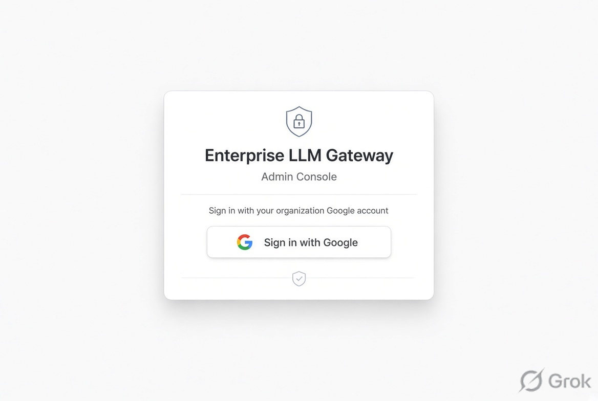
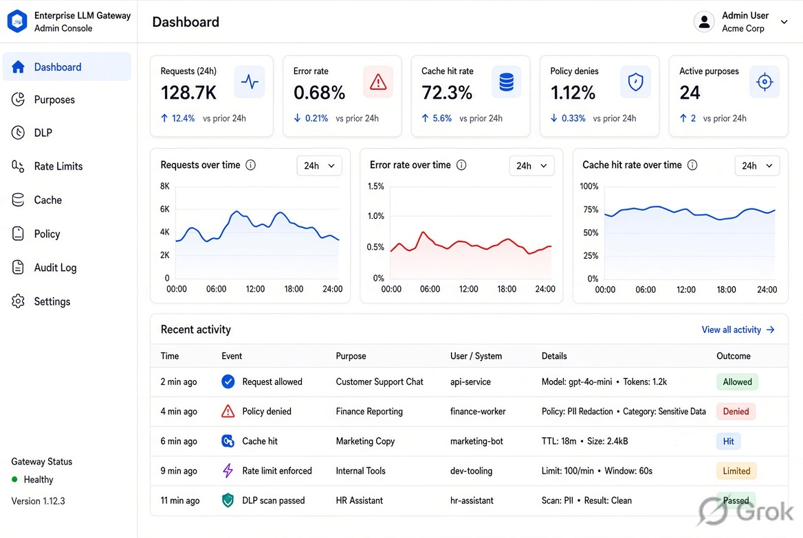
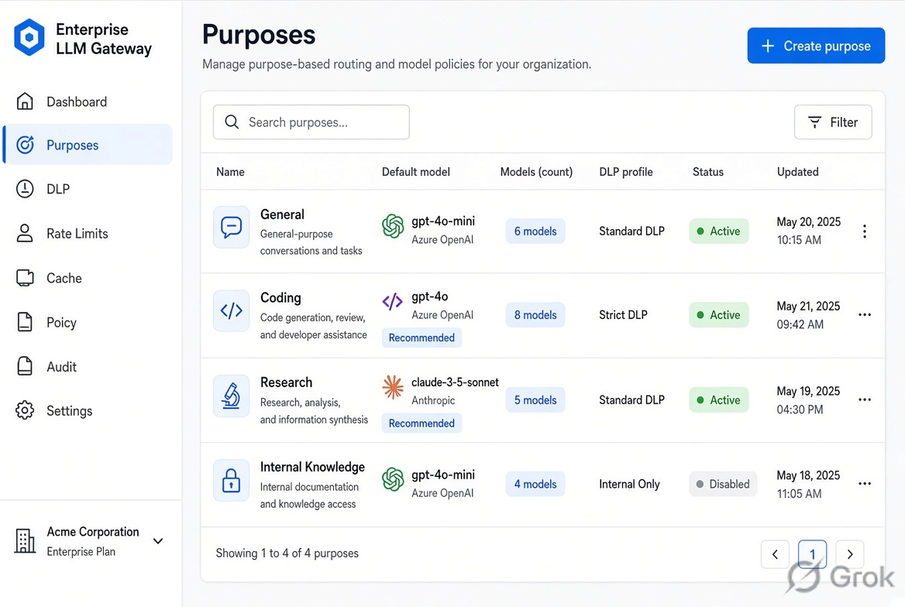
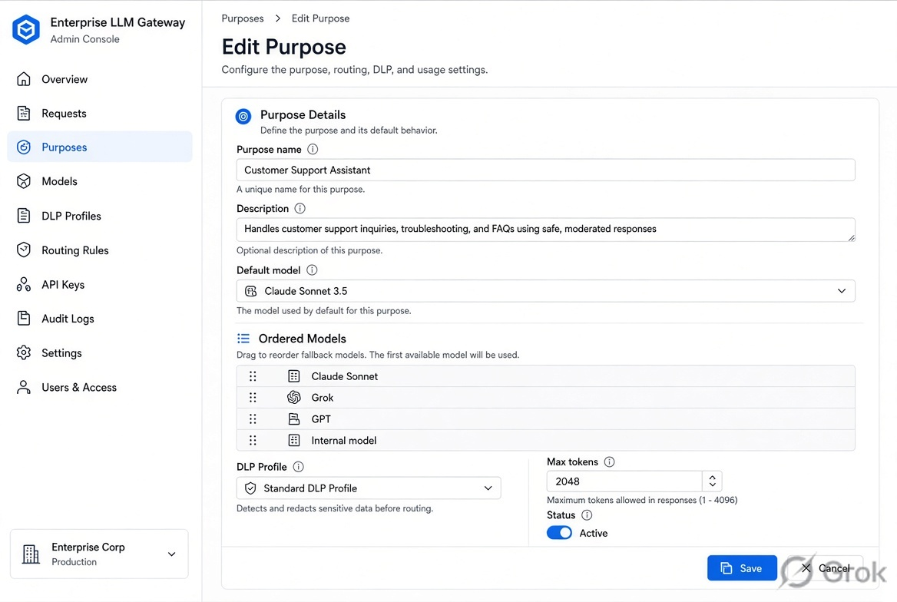
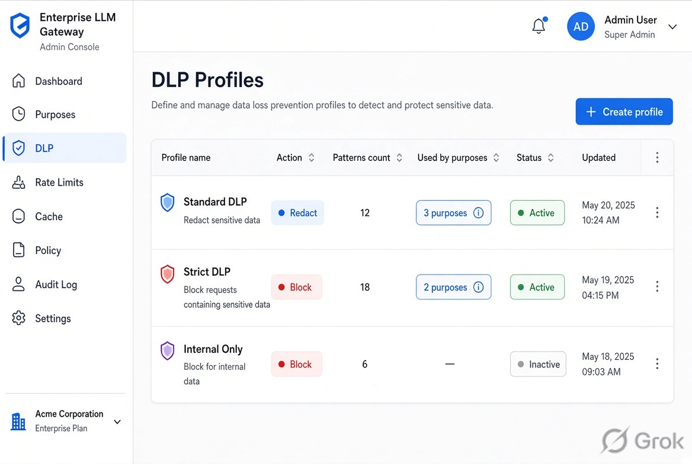
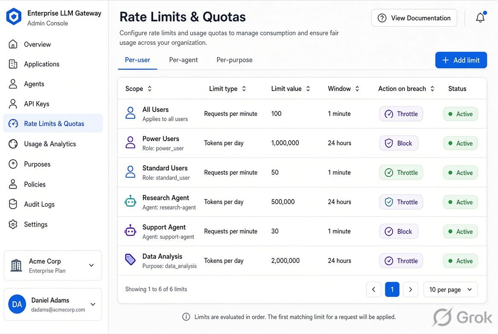
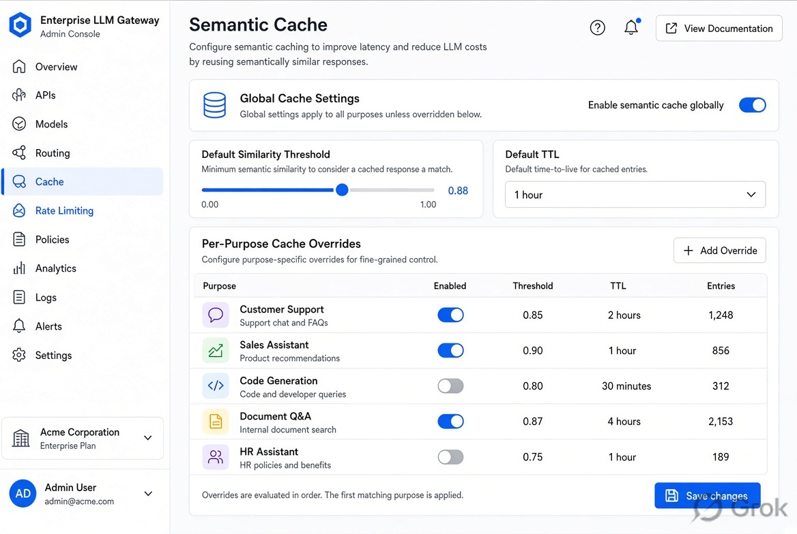
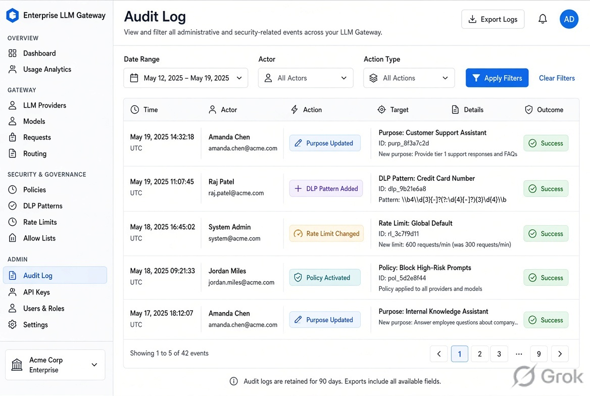

# UI Specification — Admin Console

> **Status:** Approved for Implementation Phase 5 (Admin UI)  
> **Last updated:** 2026-08-15  
> **Audience:** Worker implementing the console; Strategist reviewing fidelity  
> **Architecture:** [ADR-010](adr/010-admin-console.md), [ADR-008](adr/008-authentication-sso.md), [architecture §13](architecture.md#13-admin-console)  
> **Roadmap:** [implementation-roadmap.md](implementation-roadmap.md) — this spec is a **prerequisite** for Admin UI build

This document is **implementable**. Reference mockups live under [`docs/assets/ui/`](assets/ui/) and are embedded on the matching screens below. They illustrate layout and density; the text specification is authoritative where a mockup’s sidebar labels or extra nav items differ from the locked IA in §3.2.

---

## 1. Purpose and scope

The Admin Console is the **only v1 human configuration surface**. A handful of platform admins (AI CoE) change purposes, DLP, quotas, cache, and which policy snapshot is live — without a code deploy.

| In scope (v1) | Out of scope |
|---------------|--------------|
| Admin Console UI (this spec) | End-user **chat UI** / IDE chrome |
| Google OIDC login for **Admin** | Admin **configuration API** (backlog B3) |
| Screens in §5 | User directory (IdP owns it) |
| Form-driven / table editors | Visual Rego / graph policy builder |
| Audit log of **admin actions** | Live log/trace explorer (Grafana/Loki) |
| Links out to observability / metering | Prompt / conversation browser |
| | Agent credential issuance |

Implementation is **Phase 5**. Phases 1–4 may expose **no** console routes, or a login wall only.

---

## 2. Users and access

| Principal | Console |
|-----------|---------|
| **Admin** | Full v1 surfaces after Google OIDC + role `admin` |
| **Super AI User** | **No** config visibility. Data-plane overrides only (ADR-002) |
| **Normal AI User** | **No** access |
| **Agent** | **No** access |
| Unauthenticated | **Login only** — fail-closed (ADR-008) |

**Rules**

- Session: same Google OIDC / short-lived tokens as the Gateway. No console-specific password store.
- Authenticated but **not** Admin hitting any `/admin/*` route (or equivalent): **403** (or 404) with a **generic** “You don’t have access” page. **No** sidebar, **no** purpose names, **no** catalogue leakage (ADR-010).
- Idle session expiry follows token/`exp` + refresh failure → return to Login.
- Display name in the header: given name or email **initials**; do not use email as a high-volume label in analytics (ADR-007).

---

## 3. Information architecture

### 3.1 Visual system

| Token | Direction |
|-------|-----------|
| Theme | **Light**, clean enterprise SaaS |
| Accent | **Blue** (primary buttons, active nav, links, focus ring) |
| Surfaces | White content cards on a light grey canvas (`#f6f8fa` class) |
| Type | System UI stack; 13–14 px body; 12 px table meta |
| Density | **Dense but readable** tables (comfortable row height ~40–44 px) |
| Chrome | Fixed **left sidebar** (~240 px) + top bar (title, environment, user menu) |
| Primary action | Solid blue button, top-right of the page or form footer |
| Destructive | Red text/outline; **never** the default focused button |

Desktop-first. Minimum supported viewport **1280×720**. Below 1024 px: sidebar collapses to icons or a drawer; do not design a separate mobile product.

### 3.2 Locked sidebar

Order is locked. Active item: blue text + left bar. Disabled items are not used in v1 — hide, do not grey-tease future modules.

1. **Dashboard**
2. **Purposes**
3. **DLP**
4. **Rate Limits**
5. **Cache**
6. **Policy**
7. **Audit Log**
8. **Settings**

Footer of sidebar: product name **Enterprise LLM Gateway**, environment badge (`dev` / `staging` / `prod`), short version / git SHA.

### 3.3 High-level flow

```text
Login (Google OIDC)
    │
    ├── not admin ──► Access denied (no chrome)
    └── admin ──────► Dashboard
                          │
                          ├── Purposes ──► Create / Edit Purpose ──► (draft) Policy
                          ├── DLP ───────► Profile / patterns
                          ├── Rate Limits
                          ├── Cache
                          ├── Policy ────► Validate / Publish snapshot
                          ├── Audit Log ─► (read-only)
                          └── Settings
```

Mutations write through **draft → validate → publish** where they affect the pinned policy snapshot (purposes, DLP bindings, cache flags, quotas as snapshot data). Settings toggles that are operational (per-user metrics) may apply immediately **and** emit an audit event with auto-expiry where ADR-007 requires it.

---

## 4. Global UX rules

### 4.1 Save / Cancel

- Forms: sticky footer **Cancel** (secondary) + **Save** (primary). Cancel with dirty fields → “Discard unsaved changes?”
- List pages: primary **Create** or **Save changes** top-right.
- Keyboard: `Esc` = cancel/close modal if not dirty, else confirm discard. `⌘/Ctrl+Enter` submits the focused form.
- After successful save: toast “Saved” (or “Saved as draft — publish from Policy to activate”) and stay on the page unless the flow says otherwise.

### 4.2 Destructive actions

Always a **modal confirmation**: title, one-sentence consequence, object name in bold, **Cancel** + red **Confirm**.

Examples: retire a purpose, delete a custom DLP pattern, purge cache, rollback/publish that replaces the live snapshot, disable DLP for a purpose.

**`General` purpose:** delete/retire control is **absent** (not disabled-with-tooltip only). Copy in the edit page: “General is mandatory and cannot be deleted.”

### 4.3 Audit

Every mutating action (including Settings toggles and cache purge) writes an Audit Log row: actor, action, object type/id, before/after or equivalent, snapshot version if applicable, timestamp. UI never shows secrets or raw prompts.

Read-only views that change **investigation posture** (per-user metrics on) are audit-worthy (ADR-007, ADR-010).

### 4.4 Empty, loading, error

| State | Pattern |
|-------|---------|
| **Loading** | Skeleton rows or a centred spinner in the content card; sidebar stays interactive |
| **Empty** | Illustration-free; one sentence + primary CTA (e.g. “No custom DLP patterns. Add pattern”) |
| **Inline validation** | Red text under the field; Save stays enabled but submit fails with focus on first error |
| **Page error** | Banner: what failed + **Retry**. No stack traces |
| **Permission** | Generic access-denied; no nav |
| **Toast** | Success (green-grey) and failure (red); 4 s; do not toast raw backend bodies |

### 4.5 Draft vs live

When the form edits snapshot-backed config, show a pill: **Draft** vs **Matches live snapshot**. A yellow banner if drafts exist: “Unpublished changes. Go to **Policy** to validate and publish.”

### 4.6 Accessibility baseline

- Every input has a visible `<label>`
- Contrast ≥ WCAG AA for text and the blue accent on white
- Focus ring visible (2 px blue)
- Modals trap focus; return focus to the opener
- Tables: header scope; sort buttons are real buttons
- Do not rely on colour alone for redact vs block (use icon + text)

### 4.7 Environment

`prod` banner (thin, amber) under the top bar: “You are editing **production** policy.”

---

## 5. Screen specifications

### 5.1 Login



**Purpose.** Authenticate with Google. The only screen unauthenticated users may see.

**Entry.** Any unauthenticated request to the console origin; post-logout; expired refresh.

**UI**

- Centred card on light grey: product wordmark, “Admin Console”, short line: “Sign in with your corporate Google account.”
- Single primary button: **Continue with Google**
- No username/password fields, no “sign up”
- Fine print: “Admin role required. Other users cannot view configuration.”

**Actions.** Click → OIDC Authorization Code (+ PKCE). Success + `admin` → Dashboard. Success + not admin → Access denied. Failure / IdP down → banner “Sign-in unavailable. Try again.” (fail-closed; no guest mode).

**Empty / error.** IdP error query params mapped to a safe message. No token values on screen.

**Notes.** ADR-008. Same IdP as the data plane.

---

### 5.2 Dashboard



**Purpose.** Orient an admin: live snapshot, drafts waiting, recent denials/blocks (counts only), links out.

**Entry.** Sidebar **Dashboard**; post-login landing.

**UI**

- Page title: **Dashboard**
- Cards (2×2 or 4-up):
  - **Live policy** — snapshot id/version, published-at, published-by (display name)
  - **Unpublished drafts** — count; CTA **Review in Policy**
  - **DLP (24 h)** — allow / redact / block **counts** (from metering/obs; not payloads)
  - **Policy denies (24 h)** — count
- Table: **Recent admin actions** (last 10 from Audit Log) — time, actor, action, object; row click → Audit Log filtered
- **Operational links** (secondary): Grafana / metering dashboard URLs from Settings — open in new tab. Not a second Grafana.

**Actions.** None that mutate, except following links.

**Empty.** “No admin actions yet.” Cards show `—` if metrics are unavailable (fail-open telemetry; do not block the page).

**Error.** Metrics card: “Metrics unavailable” + Retry. Page still usable.

**Notes.** No raw prompts. No per-user series unless Settings toggle is on (then say “per-user metrics are **on** until {expiry}”).

---

### 5.3 Purposes list



**Purpose.** Catalogue of purposes the classifier and clients may use.

**Entry.** Sidebar **Purposes**.

**UI**

- Title **Purposes** · primary **Create purpose**
- Filter: status (active / retired), search by name
- Table columns: Name · Status · Default / first model · DLP profile · Cache · Updated · (row actions)
- `General` row: lock icon; no delete; cannot retire

**Actions**

- Row click or **Edit** → Create / Edit Purpose
- **Retire** (overflow) → confirm; not shown for `General`
- **Create purpose** → empty edit form

**Empty.** Should not happen if `General` ships built-in. If search matches nothing: “No purposes match.”

**Validation.** Name unique (slug). Retire blocked if it is the only active purpose besides rules that require `General`.

**Notes.** ADR-002: `General` always present, not deletable. Retire ≠ delete history; retired purposes stay in audit and old snapshots.

---

### 5.4 Create / Edit Purpose



**Purpose.** Define one purpose: identity, ordered models, Super allowlist, DLP profile, cache, status.

**Entry.** Create / row Edit from Purposes list.

**UI — sections (single scrolling form)**

1. **Identity** — Display name, slug (immutable after first publish), description (optional), status (active / retired). `General`: slug locked, status cannot be retired.
2. **Routing** — **Ordered model list** (drag handle or up/down): catalogue pickers (parent + sub-model). First row is the default candidate. Empty list is invalid except while drafting — publish requires ≥ 1 or an explicit “fall through to General” checkbox (default on for non-General).
3. **Super AI User allowlist** — optional extra models this purpose may use on override. Empty = no extras.
4. **DLP** — profile select (from DLP screens). Required for publish.
5. **Cache** — inherit global / enabled / disabled; optional threshold and TTL override (see Cache).
6. **External egress** — allow / deny (policy data). Default deny for a new custom purpose until the admin sets it.

**Actions.** **Cancel** · **Save draft** · (optional) **Save and go to Policy**. No “publish” on this page — activation is **Policy**.

**Empty.** Model catalogue empty → “No models in catalogue. Sync from providers (Settings / ops job) or add manually if Phase 3 tooling allows.”

**Validation**

- Name required; slug `^[a-z0-9_]+$`
- Cannot remove `General`
- Ordered list: no duplicate model ids
- DLP profile must exist

**Notes.** Ordered list **is** routing (ADR-004). DLP profile binding is how Policy passes `dlp_profile` (ADR-003). Changes are drafts until Policy publish.

---

### 5.5 DLP



**Purpose.** Manage **profiles** (category → redact/block) and **custom patterns**.

**Entry.** Sidebar **DLP**. Two tabs: **Profiles** | **Patterns**.

#### Profiles tab

- Table: Name · Default action · Block categories (summary) · Used by (purpose count) · Updated
- **Create profile** / row → edit panel or page:
  - Name, description
  - Per-category action: Allow / **Redact** / **Block** (default Redact)
  - Toggle packs: secrets, PII, custom-pattern pack
- Cannot delete a profile still bound to an active purpose (error names the purposes)

#### Patterns tab

- Table: Name · Category · Action hint · Enabled · Updated
- **Add pattern**: name, category, regex or dictionary (plain text, one term per line), default action, notes
- Test drawer (nice-to-have v1): paste **synthetic** sample → highlight matches. **Never** persist the sample.

**Actions.** Save draft (snapshot-backed). Disable pattern (confirm if in use).

**Empty.** “No custom patterns. Built-in secret/PII packs still apply via profiles.”

**Error.** Invalid regex → field error, do not save. Pattern that would log the matched secret: UI does not show capture groups in Audit.

**Notes.** ADR-003: no public LLM for DLP; text only in v1; fail-closed on scan failure for external routes (not a UI toggle — explained in helper text). File/image DLP is **not** in this UI (backlog B5).

---

### 5.6 Rate Limits & Quotas



**Purpose.** Set per-**user**, per-**agent**, per-**purpose** limits (ADR-004). Enforcement hardens in Phase 6; the console still edits the data.

**Entry.** Sidebar **Rate Limits**.

**UI**

- Tabs or filter chips: **User** · **Agent** · **Purpose** · **Defaults**
- Table: Scope · Identifier (user id / agent id / purpose slug) · RPM or RPS · Token budget (e.g. per day) · On exceed (throttle 429 / hard-block) · Updated
- **Add rule** / Edit drawer: scope, identifier picker (purpose select; user/agent as id string — **no** user directory browser), numbers, action
- **Defaults** panel: global defaults for humans vs agents (agents **stricter**)

**Actions.** Save draft. Delete rule → confirm.

**Empty.** “Using defaults only. Add a rule to override.”

**Validation.** Positive integers; agent default burst ≤ human default unless admin explicitly overrides (warn, do not hard-block the save).

**Notes.** Overrides do not bypass quota unless a higher envelope is granted here. Agent identifiers may not exist until B1; still allow the fields so Phase 6 can enforce.

---

### 5.7 Cache



**Purpose.** Global semantic-cache policy, per-purpose overrides, manual invalidation (ADR-005).

**Entry.** Sidebar **Cache**.

**UI**

- **Global** card: enabled, default cosine threshold (start band 0.88–0.90), default TTL, max size / LRU note (read-only if ops-owned)
- **Per-purpose overrides** table: purpose, enabled/inherit/off, threshold, TTL · Edit
- **Invalidate** card: purge by purpose, entry id, or **Purge all eligible** — destructive confirm: “Cached answers will miss until rebuilt. This does not delete conversation memory.”

**Actions.** Save draft (flags/thresholds). Invalidate runs **immediately** (ops action) + audit; not waiting for Policy publish.

**Empty.** “All purposes inherit global settings.”

**Error.** Invalidate backend fail → toast; do not pretend it succeeded.

**Notes.** Helper text: only **DLP-clean, non-sensitive** prompts are cached; redacted text is never a shared key. Cache failure **fail-open** (users still served from origin).

---

### 5.8 Policy

<!-- Mockup pending — no Policy screen image in the approved set. -->

**Purpose.** Admin-facing **snapshot lifecycle**: what is live, what is draft, validate, publish. Not a Rego IDE.

**Entry.** Sidebar **Policy**; Dashboard “Review in Policy”; banners on other pages.

**UI**

- **Live snapshot** card: version id, hash, published-at, publisher, link **Download / view summary** (structured JSON/YAML read-only: purpose list, bindings — not raw Rego unless a collapsible “advanced” exists)
- **Draft** card: “Includes unpublished changes from Purposes, DLP, Rate Limits, Cache.” Diff summary: counts of added/changed objects
- Buttons: **Validate** · **Publish** (disabled until validate passed in this session) · **Discard draft** (confirm)
- Validate results: table of errors/warnings (e.g. purpose missing DLP profile, empty model list)
- Publish confirm modal: “Data plane will pin **this** snapshot. In-flight requests keep the previous pin. Continue?”

**Actions.** Validate (no audit required if read-only check). Publish → audit + new live version. Discard draft → confirm + audit.

**Empty.** First install: live snapshot is the shipped default (includes `General`).

**Error.** Validate fail → Publish stays disabled. Publish fail → live snapshot unchanged; banner.

**Notes.** ADR-002: data plane evaluates a **pinned** snapshot. Console does not hot-edit live rows mid-request. No visual policy graph in v1.

---

### 5.9 Audit Log



**Purpose.** Read-only history of **admin** (and security-relevant) events.

**Entry.** Sidebar **Audit Log**; Dashboard recent-actions; deep links `?object=purpose:coding`.

**UI**

- Filters: date range, actor, action type (create/update/retire/publish/purge/toggle), object type
- Table: Time · Actor (stable id + display) · Action · Object · Snapshot · Result
- Row expand: before/after JSON (metadata only)
- Export CSV (metadata columns only) — optional v1; if present, audit the export

**Actions.** None that mutate config. **No** “delete log.”

**Empty.** “No events match filters.”

**Error.** Store unavailable → banner; empty table.

**Notes.** No raw prompts, no token values, no DLP matched secrets. SIEM remains the long-term sink (ADR-007); this is the in-product view for admins.

---

### 5.10 Settings

<!-- Mockup pending — no Settings screen image in the approved set. -->

**Purpose.** System toggles and operational links — not user management.

**Entry.** Sidebar **Settings**.

**UI — groups**

1. **Privacy / observability (ADR-007)**
   - **Per-user metrics:** Off (default) / On until {datetime}. On requires confirm: “High cardinality. Auto-expires. Audited.”
   - **Break-glass debug logging:** Off / On until {datetime}. Confirm + typed environment name (`prod`) if env is prod.
2. **Operational links**
   - Grafana URL, metering/BigQuery console URL, docs URL — editable text; used on Dashboard
3. **Catalogue**
   - Read-only last model-sync time; **Request sync** if Phase 3 exposed a job (rate-limited, audited)
4. **About**
   - Binary version, config schema version, live snapshot id

**Actions.** Toggle save applies **immediately** (with expiry) + audit. Link save is immediate.

**Empty.** URLs optional.

**Error.** Toggle API fail → revert switch UI.

**Notes.** No create-user, no password reset, no group CRUD. Role mapping remains IdP + static map (a **read-only** table of group → role may be shown later; editing the map in v1 can be a simple table if product wants it — if included, treat like other snapshot data and publish via Policy). **v1: include a read-only Role map card** (group/claim → role) so admins can see why someone is Admin; editing the map is a **Save draft + Policy publish** flow if implemented, else “managed in config” helper text.

---

### 5.11 Access denied (supporting)

**Purpose.** Authenticated non-admin.

**UI.** No sidebar. Wordmark + “You don’t have access to the Admin Console.” + **Sign out**. Zero config.

---

## 6. Cross-screen flows

### 6.1 Create purpose end-to-end

1. Purposes → **Create purpose**
2. Fill identity, ordered models, DLP profile, egress, cache inherit
3. **Save draft** → toast “Saved as draft”
4. Yellow banner → **Policy**
5. **Validate** → fix errors if any → **Publish** → confirm
6. Purposes list shows the new purpose as matching live snapshot
7. Audit Log: `purpose.create` + `policy.publish`

### 6.2 Attach DLP profile to purpose

1. DLP → create/edit profile (category actions) → Save draft
2. Purposes → Edit purpose → DLP select → Save draft
3. Policy → Validate → Publish
4. Audit: `dlp_profile.update` (if any) + `purpose.update` + `policy.publish`

### 6.3 Change rate limit and see audit

1. Rate Limits → Edit default or add purpose rule → Save draft
2. Policy → Publish (if quota is snapshot-backed) **or** save immediate if Phase 6 chooses hot-config for limits — **v1 spec: snapshot-backed**, same as other policy data
3. Audit Log filter `action=quota.update` → expand before/after

### 6.4 Toggle cache and save

1. Cache → set purpose `coding` to **disabled** → Save draft
2. Policy → Publish
3. Optional: **Invalidate** that purpose immediately (confirm) so old entries are not served during rollout
4. Audit: `cache.settings.update` + `policy.publish` + `cache.invalidate`

---

## 7. Open questions / deferred UI

| Item | Stance |
|------|--------|
| End-user chat UI | **Out of scope** (this spec) |
| Admin configuration API | Backlog B3; same model when it lands |
| Visual policy / Rego builder | Deferred; forms + snapshot summary only |
| Deep log / trace explorer | Observability stack |
| User management | IdP |
| Pattern “test” drawer persisting samples | Do not persist |
| Editing static role map in UI | Optional; read-only card is enough for v1 if edit stays in config |
| Dual-control / two-person publish | Not locked (residual §14.5); single Admin publish + audit |
| Mobile-native console | Desktop-first only |
| Dark theme | Not v1 |

**UI test notes (Phase 5):** unauthenticated → login only; non-admin → no chrome; `General` cannot be deleted; publish disabled until validate; destructive confirms; audit row after each mutation. Details live in [testing-strategy.md](testing-strategy.md) and the Phase 5 exit checklist.

---

## Related

- [ADR-010 Admin Console](adr/010-admin-console.md)
- [ADR-008 Authentication & SSO](adr/008-authentication-sso.md)
- [Architecture §13](architecture.md#13-admin-console)
- [Implementation roadmap](implementation-roadmap.md) (Phase 5)
- [Testing strategy](testing-strategy.md)
