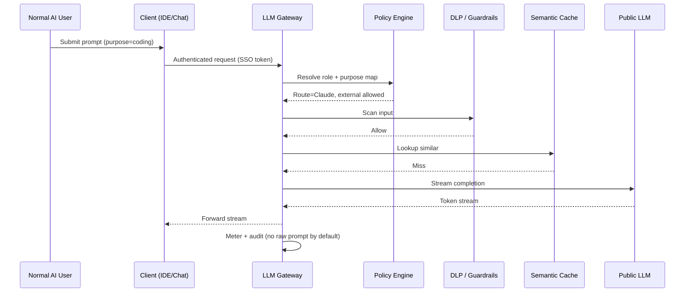
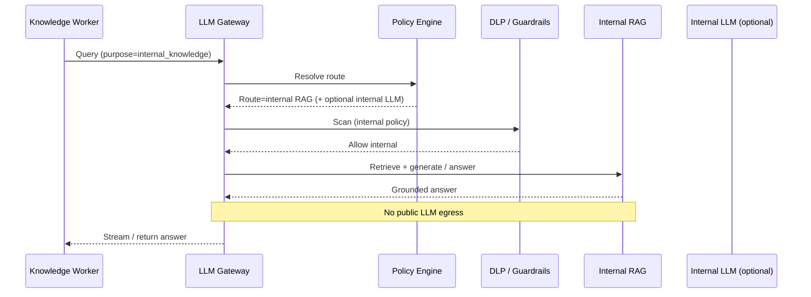
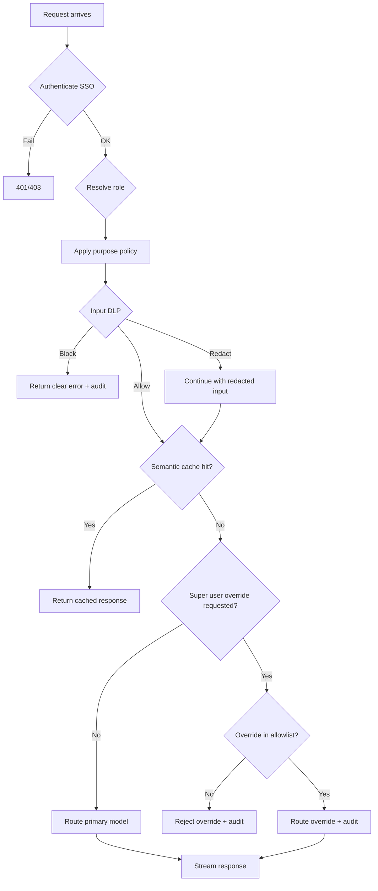

# 03 – Use Cases

## Personas

| Persona | Description | Goals | Pain Points |
|---------|-------------|-------|-------------|
| **Asha** (Corporate Admin / AI CoE) | Platform owner who defines AI policy for the company | Purpose → model maps, safe defaults, cost control, audit readiness | Shadow AI; one-off vendor deals; no central view of risk or spend |
| **Dev** (Normal AI User) | Software engineer using AI for coding and docs | Fast answers; correct model for the task; stay compliant without thinking about it | Hard-coded tools; fear of pasting secrets; “which model am I allowed to use?” |
| **Sam** (Super AI User) | Staff engineer / researcher with elevated AI privileges | Override default model when a task needs a stronger or different model | Needs flexibility without becoming a security loophole |
| **Maya** (Knowledge worker) | Analyst who asks questions about internal policies and product docs | Accurate answers from company knowledge | Public LLMs hallucinate or must not see internal docs |
| **Ops** (SRE / Platform) | Runs the gateway in the VPC | Low latency, high availability, clear dashboards | Another hop that must not become a bottleneck |

## User Stories / Scenarios

### 1. Corporate Admin sets purpose → model mappings

**As** Asha  
**I want** to define which purposes map to which destinations and models  
**So that** the company standardises AI use without locking into a single vendor forever.

**Acceptance Criteria**
- [ ] I can create purposes such as `coding`, `realtime`, `image`, `internal_knowledge`, `general`.
- [ ] For each purpose I can set primary route, allowed models, fallbacks, and whether external egress is allowed.
- [ ] Example defaults work out of the box: coding → Claude; realtime → Grok; image → Gemini; internal knowledge → internal RAG / internal LLM.
- [ ] Changes are versioned and audited; rollout can be staged (draft → published).
- [ ] Normal users cannot see or use destinations outside their purpose map.

### 2. Normal AI User makes a request (follows policy)

**As** Dev  
**I want** my IDE / chat client to send a coding request through the gateway  
**So that** I get a good model without choosing vendors or violating policy.

**Acceptance Criteria**
- [ ] I authenticate via SSO; gateway resolves me as a Normal AI User.
- [ ] Client declares purpose `coding` (or equivalent).
- [ ] Gateway applies DLP, checks cache, routes to the corporate coding model (e.g. Claude).
- [ ] Response streams to my client with minimal added latency.
- [ ] I may set a personal preference only among models allowed for `coding`.
- [ ] Metering records purpose, route, tokens, latency — not my full prompt by default.

### 3. Super AI User overrides within allowed limits

**As** Sam  
**I want** to temporarily use a different allowed model for a hard research task  
**So that** I am not stuck on the default when policy still permits alternatives.

**Acceptance Criteria**
- [ ] I am mapped to Super AI User via IdP group.
- [ ] I can request an override to a model/provider on the Super-user allowlist for that purpose.
- [ ] Overrides outside the allowlist are rejected with a clear error.
- [ ] Every override is written to the audit log (who, when, purpose, from → to).
- [ ] Spend still counts against my team’s budget if budgets are enabled.

### 4. Internal knowledge query → enterprise RAG (never leaves)

**As** Maya  
**I want** answers grounded in internal policies and product docs  
**So that** I do not paste confidential material into a public LLM.

**Acceptance Criteria**
- [ ] Purpose `internal_knowledge` routes to the enterprise RAG engine (and/or internal LLM), not a public provider.
- [ ] Input never leaves the trust boundary for this purpose (except internal systems).
- [ ] Answer includes grounding metadata when the RAG engine provides it (e.g. doc ids).
- [ ] Audit trail shows route = internal RAG; compliance can prove no public egress.

### 5. Input guardrail / redaction triggers

**As** Dev  
**I want** the gateway to stop me from sending API keys or customer PII externally  
**So that** I do not create a security incident by accident.

**Acceptance Criteria**
- [ ] If I paste a secret/API key into a prompt destined for an external model, the gateway blocks or redacts per policy.
- [ ] I receive a clear message explaining the category of issue (not a silent drop).
- [ ] Blocked attempts are logged for security review without storing the full secret in cleartext if avoidable.
- [ ] If purpose is internal-only, the same content may still be allowed to internal RAG under a different policy.

### 6. Semantic cache hit

**As** Ops / Finance (and end users indirectly)  
**I want** near-duplicate prompts to reuse safe cached answers  
**So that** cost and latency drop without violating isolation or policy.

**Acceptance Criteria**
- [ ] Eligible requests compute a semantic similarity against the cache scope (tenant / purpose / ACL).
- [ ] On a high-confidence hit, the gateway returns the cached response without calling the provider.
- [ ] Cache entries respect policy version, purpose, and data-classification boundaries (no cross-tenant or cross-ACL leakage).
- [ ] Metrics show cache hit rate and estimated cost avoided.
- [ ] Admins can disable cache for sensitive purposes.

### 7. Fallback when a provider is unavailable

**As** Dev  
**I want** my request to succeed on a configured backup when the primary provider is down  
**So that** AI tooling remains usable during vendor outages.

**Acceptance Criteria**
- [ ] Admin configures ordered fallbacks per purpose (e.g. Claude → internal coding model).
- [ ] On provider 5xx / timeout / rate limit, gateway tries the next allowed fallback.
- [ ] User is not forced to re-auth; streaming still works on the fallback path.
- [ ] Incident metrics and audit note primary failure + fallback used.
- [ ] If no fallback is allowed, user gets a clear, actionable error.

### 8. Rate a response (1–5 stars)

**As a** Normal or Super AI User  
**I want** to rate a response with 1–5 stars  
**So that** the organisation can learn which model + purpose combinations work well and which do not.

**Acceptance Criteria**
- [ ] Rating control is available after every response.
- [ ] Submitting a rating is optional and non-blocking (the main request already completed).
- [ ] 1-star ratings are clearly recorded as strong negative signals in analytics.
- [ ] The rating is linked to request metadata (model, purpose, latency, role, route, cache hit/miss) without storing raw prompt/response by default.
- [ ] Optionally 2-star ratings are also treated as strong negative signals per tenant config.

## Detailed Use-Case Flows

### Happy path – Normal user, external model

### Internal knowledge – stays inside the trust boundary

### Guardrail block vs Super-user override

## Secondary / Edge Cases

1. Client omits purpose → gateway applies default purpose or requires purpose (tenant config).
2. User preference conflicts with corporate map → corporate map wins; preference ignored with notice.
3. Cache hit exists but policy version changed → treat as miss.
4. Partial stream then provider disconnect → gateway surfaces error; client may retry; no silent truncation without error.
5. Admin disables a provider mid-day → new requests fail over or error per policy; in-flight streams complete or abort cleanly.

## Failure / Error Scenarios

1. IdP unavailable → fail closed for new sessions; document runbook for break-glass admin.
2. Policy store unavailable → fail closed for external egress; optional cached last-known policy for internal-only (configurable, default strict).
3. DLP service timeout → fail closed for external; log and alert.
4. All providers and fallbacks fail → structured error with correlation id for support.
5. Semantic cache backend down → bypass cache (fail open on cache only), continue to model.
